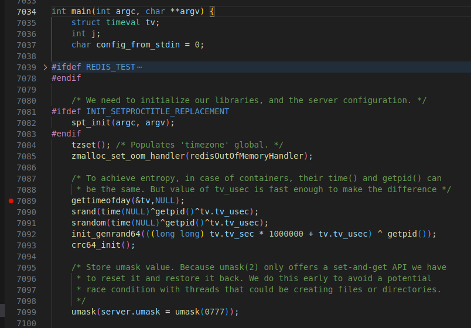
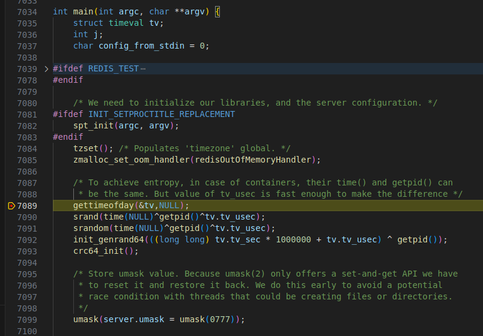

# redis

redis 是以一个有C 编写的、开源的、基于内存的、可持久化的键值对存储系统。redis 的性能非常高，代码可读性强。

## 编译与调试

1. 下载最新的稳定半源码包

   ```shell
   wget https://download.redis.io/redis-stable.tar.gz
   ```

2. 解压编译

   ```shell
   tar -xzvf redis-stable.tar.gz
   cd redis-stable
   make CFLAGS="-g -O0"
   ```

3. 使用 vscode 打开 redis-stable 并且新建文件 launch.json

   ```json
   {
       "version": "0.2.0",
       "configurations": [
           {
               "name": "(gdb) 启动",
               "type": "cppdbg",
               "request": "launch",
               "program": "${workspaceFolder}/src/redis-server",
               "args": ["redis.conf"],
               "stopAtEntry": false,
               "cwd": "${workspaceFolder}",
               "environment": [],
               "externalConsole": false,
               "MIMode": "gdb",
               "setupCommands": [
                   {
                       "description": "为 gdb 启用整齐打印",
                       "text": "-enable-pretty-printing",
                       "ignoreFailures": true
                   }
               ]
           }
       ]
   }
   ```

4. 在 server.c 设置断

   

5. 按 F5 开始调试

   
