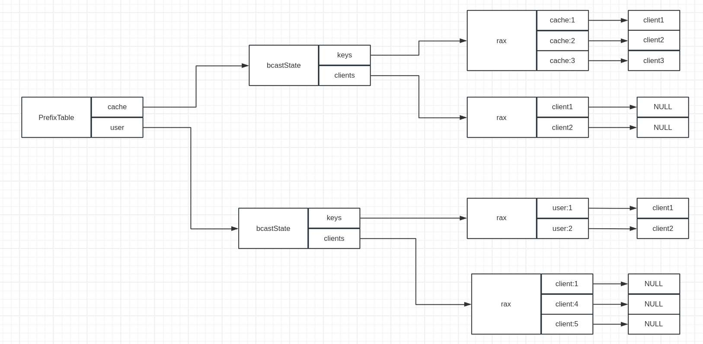

# 客户端缓存

redis客户端进行查询时需要通过网络请求，在高并发场景中难免造成性能损失。为了解决这一问题，redis引入了本地缓存。客户端查询数据时首先检查本地是否存在，然后再视情况决定是否向服务端发送请求。本地缓存的引入同时带来了多端缓存一致性的问题，为此，redis 又引入了跟踪机制。开启跟踪机制后，redis 会记录客户端查询的所有键，当这些键发生变化后通知客户端键已变化，此时客户端需要将这些键的本地缓存删除。

## 应用示例

### 基本应用

下面是一个基本实例

| client1                                                      | client2                                                |
| ------------------------------------------------------------ | ------------------------------------------------------ |
| 127.0.0.1:6379> hello 3<br/>1# "server" => "redis"<br/>2# "version" => "7.2.3"<br/>3# "proto" => (integer) 3<br/>4# "id" => (integer) 3<br/>5# "mode" => "standalone"<br/>6# "role" => "master"<br/>7# "modules" => (empty array) |                                                        |
| 127.0.0.1:6379> CLIENT TRACKING on<br/>OK                    |                                                        |
| 127.0.0.1:6379> get score<br/>(nil)                          |                                                        |
|                                                              | 127.0.0.1:6379> set score 1<br/>OK<br/>127.0.0.1:6379> |
| 127.0.0.1:6379> PING<br/>-> invalidate: 'score'<br/>PONG     |                                                        |

1. 为了支持追踪机制，redis 推出了 RESP3 协议，`hello 3` 要求客户端与服务端使用 RESP3 协议进行通信
2. `CLIENT TRACKING on` 开启追踪机制，此后服务端会记录客户端查询的键，并在键失效后推送消息给客户端段
3. client2 修改 score 后，服务端推送失效消息给客户端

### 广播模式

使用 BCAST 参数开启广播模式，结合 PREFIX 参数使用，标识客户端仅关注指定前缀的键。在广播模式下，服务端会给所有关注了该前缀的客户端发送失效消息，无论客户端是否查询过这些键。

非广播模式下，服务端会给查询过相关键的客户端发送失效消息。

| client1                                                      | client2                               |
| ------------------------------------------------------------ | ------------------------------------- |
| 127.0.0.1:6379> CLIENT TRACKING on BCAST PREFIX cached<br/>OK |                                       |
|                                                              | 127.0.0.1:6379> set cached:1 1<br/>OK |
| 127.0.0.1:6379> ping<br/>-> invalidate: 'cached:1'<br/>PONG  |                                       |

### OPTIN、OPTOUT、NOLOOP

+ optin：此模式下，仅在客户端执行 `CLIENT CACHING on` 后，下一条查询命令的键才会被服务端记录，只能用于非广播模式
+ opout：此模式下，仅在客户端执行 `CLIENT CACHING off 后，下一条查询命令的键才不会被服务端记录，只能用于非广播模式
+ noloop：此模式下，某个客户端导致键变化过后，服务端不会给该客户端发送发送失效消息，可以用于广播模式和非广播模式

### 转发模式

为了使 RESP2 协议支持追踪机制，服务端会将失效键的消息转发到特定的频道 `__redis__:invalidate`

| client1                                                      | client2                                              | client3                            |
| ------------------------------------------------------------ | ---------------------------------------------------- | ---------------------------------- |
| 127.0.0.1:6379> SUBSCRIBE redis:invalidate<br/>1) "subscribe"<br/>2) "redis:invalidate"<br/>3) (integer) 1 |                                                      |                                    |
| 127.0.0.1:6379> hello<br/> 1) "server"<br/> 2) "redis"<br/> 3) "version"<br/> 4) "7.2.3"<br/> 5) "proto"<br/> 6) (integer) 2<br/> 7) "id"<br/> 8) (integer) 5<br/> ... |                                                      |                                    |
| 127.0.0.1:6379> SUBSCRIBE redis:invalidate<br/>1) "subscribe"<br/>2) "redis:invalidate"<br/>3) (integer) 1 |                                                      |                                    |
|                                                              | 127.0.0.1:6379> CLIENT TRACKING on redirect 5<br/>OK |                                    |
|                                                              | 127.0.0.1:6379> get score<br/>"1"                    |                                    |
|                                                              |                                                      | 127.0.0.1:6379> set score 2<br/>OK |
| 127.0.0.1:6379> SUBSCRIBE redis:invalidate<br/>1) "subscribe"<br/>2) "redis:invalidate"<br/>3) (integer) 1<br/>1) "message"<br/>2) "__redis__:invalidate"<br/>3) 1) "score"<br/>Reading messages... (press Ctrl-C to quit or any key to type command) |                                                      |                                    |

## 实现原理

追踪机制的实现依赖于  [resp3](https://blog.csdn.net/LZH984294471/article/details/114233835) 协议。

client.flags 使用以下标志记录客户的追踪机制相关设置

+ CLIENT_TRACKING：客户端开启了追踪机制
+ CLIENT_TRACKING_BROKEN_REDIR：转发模式下转发到目标客户端无效则添加该标志
+ CLIENT_TRACKING_BCAST：客户端开启了广播模式
+ CLIENT_TRACKING_NOLOOP：客户端开启了 noloop 模式
+ CLIENT_TRACKING_OPTIN、CLIENT_TRACKING_OPTOUT：客户端开启了 opin、optout 模式
+ CLIENT_TRACKING_CACHING：客户端执行了 `client cache ` 命令

```C
//src/tracking.c
rax *TrackingTable = NULL; //rax类型的全局变量用于存储非广播模式的客户端查询过的键，值也是rax类型，用于存储客户端id
rax *PrefixTable = NULL; //rax类型的全局变量用于记录广播模式的前缀，值是 bcastState 类型

typedef struct bcastState {
    rax *keys;      /* Keys modified in the current event loop cycle. *///键记录已变更的键，值记录变更键的客户端
    rax *clients;   /* Clients subscribed to the notification events for this
                       prefix. *///记录所有关注该前缀的客户端
} bcastState;
```

现在假设如下情况：

client1、client2关注了cache前缀，并且client1、client2、client3分别修改了cache:1、cache:2、cache:3；client1、client4、client5关注了user前缀，并且client1、client2分别修改了user:1、user:2

相关数据结构如下所示



client 命令由 clientCommand（位于 `src/networking.c` 中） 实现，如果第三个参数是 on，则调用 `enableTracking` 开启客户端的追踪模式

```c
//src/tracking.c
void enableTracking(client *c, uint64_t redirect_to, uint64_t options, robj **prefix, size_t numprefix) {
    if (!(c->flags & CLIENT_TRACKING)) server.tracking_clients++;
    c->flags |= CLIENT_TRACKING;//为客户端设置 CLIENT_TRACKING 标志并清除其他相关标志
    c->flags &= ~(CLIENT_TRACKING_BROKEN_REDIR|CLIENT_TRACKING_BCAST|
                  CLIENT_TRACKING_OPTIN|CLIENT_TRACKING_OPTOUT|
                  CLIENT_TRACKING_NOLOOP);
    c->client_tracking_redirection = redirect_to;

    /* This may be the first client we ever enable. Create the tracking
     * table if it does not exist. */
    if (TrackingTable == NULL) {
        TrackingTable = raxNew();
        PrefixTable = raxNew();
        TrackingChannelName = createStringObject("__redis__:invalidate",20);
    }

    /* For broadcasting, set the list of prefixes in the client. */
    if (options & CLIENT_TRACKING_BCAST) {//如果客户端开启了广播模式，则将客户端关注的前缀添加到 PrefixTable 中
        c->flags |= CLIENT_TRACKING_BCAST;
        if (numprefix == 0) enableBcastTrackingForPrefix(c,"",0);//如果开启广播模式但是没有设置前缀，则会添加一个空字符串作为前缀，此时任意的键变更都会通知客户端
        for (size_t j = 0; j < numprefix; j++) {
            sds sdsprefix = prefix[j]->ptr;
            enableBcastTrackingForPrefix(c,sdsprefix,sdslen(sdsprefix));
        }
    }

    /* Set the remaining flags that don't need any special handling. *///使用命令选项设置当前客户端的追踪标志
    c->flags |= options & (CLIENT_TRACKING_OPTIN|CLIENT_TRACKING_OPTOUT|
                           CLIENT_TRACKING_NOLOOP);
}

void enableBcastTrackingForPrefix(client *c, char *prefix, size_t plen) {
    bcastState *bs = raxFind(PrefixTable,(unsigned char*)prefix,plen);//查找前缀对应的bcastState，如果不存在则创建一个并插入 PrefixTable
    /* If this is the first client subscribing to such prefix, create
     * the prefix in the table. */
    if (bs == raxNotFound) {
        bs = zmalloc(sizeof(*bs));
        bs->keys = raxNew();
        bs->clients = raxNew();
        raxInsert(PrefixTable,(unsigned char*)prefix,plen,bs,NULL);
    }
    if (raxTryInsert(bs->clients,(unsigned char*)&c,sizeof(c),NULL,NULL)) {
        if (c->client_tracking_prefixes == NULL)//这里，将前缀记录到客户端的 client_tracking_prefixes 属性中
            c->client_tracking_prefixes = raxNew();
        raxInsert(c->client_tracking_prefixes,
                  (unsigned char*)prefix,plen,NULL,NULL);
    }
}
```

### 非广播模式记录查询的键

`server/call.c` 中执行命令后，如果执行的是查询命令并且客户端开启了追踪模式则会记录命中的键

```C
//src/server.c call +3654
    if ((c->cmd->flags & CMD_READONLY) && (c->cmd->proc != evalRoCommand)
        && (c->cmd->proc != evalShaRoCommand) && (c->cmd->proc != fcallroCommand))
    {
        /* We use the tracking flag of the original external client that
         * triggered the command, but we take the keys from the actual command
         * being executed. */
        if (server.current_client &&
            (server.current_client->flags & CLIENT_TRACKING) &&
            !(server.current_client->flags & CLIENT_TRACKING_BCAST)) //开启追踪机制并且不是广播模式
        {
            trackingRememberKeys(server.current_client, c);//记录
        }
    }
```

执行 trackingRememberKeys 记录查询的键

```C
//src/tracking.c
void trackingRememberKeys(client *tracking, client *executing) {
    /* Return if we are in optin/out mode and the right CACHING command
     * was/wasn't given in order to modify the default behavior. */
    uint64_t optin = tracking->flags & CLIENT_TRACKING_OPTIN;
    uint64_t optout = tracking->flags & CLIENT_TRACKING_OPTOUT;
    uint64_t caching_given = tracking->flags & CLIENT_TRACKING_CACHING;
    if ((optin && !caching_given) || (optout && caching_given)) return;//判断是否需要记录，不需要则直接退出

    getKeysResult result = GETKEYS_RESULT_INIT;
    int numkeys = getKeysFromCommand(executing->cmd,executing->argv,executing->argc,&result);
    if (!numkeys) {
        getKeysFreeResult(&result);
        return;
    }
    /* Shard channels are treated as special keys for client
     * library to rely on `COMMAND` command to discover the node
     * to connect to. These channels doesn't need to be tracked. */
    if (executing->cmd->flags & CMD_PUBSUB) {
        return;
    }

    keyReference *keys = result.keys;

    for(int j = 0; j < numkeys; j++) {//遍历命令中所有的键
        int idx = keys[j].pos;
        sds sdskey = executing->argv[idx]->ptr;
        rax *ids = raxFind(TrackingTable,(unsigned char*)sdskey,sdslen(sdskey));//检查键在TrackingTable中是否存在，不存在则插入
        if (ids == raxNotFound) {
            ids = raxNew();
            int inserted = raxTryInsert(TrackingTable,(unsigned char*)sdskey,
                                        sdslen(sdskey),ids, NULL);
            serverAssert(inserted == 1);
        }
        if (raxTryInsert(ids,(unsigned char*)&tracking->id,sizeof(tracking->id),NULL,NULL))//将客户端插入到键对应的rax树中
            TrackingTableTotalItems++;
    }
    getKeysFreeResult(&result);
}
```

### 非广播模式下发送失效消息

当一个键被修改时，会调用 `db.c/signalModifiedKey`，其中调用了 `trackingInvalidateKey`检查修改的键是否缓存，如果是，则发送消息通知客户端

```c
//src/tracking.c
void trackingInvalidateKey(client *c, robj *keyobj, int bcast) {
    if (TrackingTable == NULL) return;

    unsigned char *key = (unsigned char*)keyobj->ptr;
    size_t keylen = sdslen(keyobj->ptr);

    if (bcast && raxSize(PrefixTable) > 0)//记录广播模式下待发送失效消息的键，后面由定时任务发送失效消息
        trackingRememberKeyToBroadcast(c,(char *)key,keylen);

    rax *ids = raxFind(TrackingTable,key,keylen);//找到键对应的rax树，其中存储了查询过该键的客户端
    if (ids == raxNotFound) return;

    raxIterator ri;
    raxStart(&ri,ids);
    raxSeek(&ri,"^",NULL,0);
    while(raxNext(&ri)) {//遍历客户端
        uint64_t id;
        memcpy(&id,ri.key,sizeof(id));
        client *target = lookupClientByID(id);
        /* Note that if the client is in BCAST mode, we don't want to
         * send invalidation messages that were pending in the case
         * previously the client was not in BCAST mode. This can happen if
         * TRACKING is enabled normally, and then the client switches to
         * BCAST mode. */
        if (target == NULL ||
            !(target->flags & CLIENT_TRACKING)||
            target->flags & CLIENT_TRACKING_BCAST)
        {
            continue;
        }

        /* If the client enabled the NOLOOP mode, don't send notifications
         * about keys changed by the client itself. */
        if (target->flags & CLIENT_TRACKING_NOLOOP &&
            target == server.current_client)
        {
            continue;
        }

        /* If target is current client and it's executing a command, we need schedule key invalidation.
         * As the invalidation messages may be interleaved with command
         * response and should after command response. *///如果导致key发生变化的正是 target，则将key添加到tracking_pending_keys中并暂缓通知 target，后续会调用 trackingHandlePendingKeyInvalidations 函数（分别在 processCommand中执行内存淘汰（server.c +3983）后以及 afterCommand中被调用）进行通知
        if (target == server.current_client && (server.current_client->flags & CLIENT_EXECUTING_COMMAND)) {
            incrRefCount(keyobj);
            listAddNodeTail(server.tracking_pending_keys, keyobj);
        } else {
            sendTrackingMessage(target,(char *)keyobj->ptr,sdslen(keyobj->ptr),0);//发送失效消息
        }
    }
    raxStop(&ri);

    /* Free the tracking table: we'll create the radix tree and populate it
     * again if more keys will be modified in this caching slot. */
    TrackingTableTotalItems -= raxSize(ids);//改键已变更则删除
    raxFree(ids);
    raxRemove(TrackingTable,(unsigned char*)key,keylen,NULL);
}
```

`sendTrackingMessage` 负责发送失效消息

```C
//src/tracking.c
void sendTrackingMessage(client *c, char *keyname, size_t keylen, int proto) {
    uint64_t old_flags = c->flags;
    c->flags |= CLIENT_PUSHING;

    int using_redirection = 0;
    if (c->client_tracking_redirection) {//如果客户端开启转发模式，则查找转发客户端
        client *redir = lookupClientByID(c->client_tracking_redirection);
        if (!redir) {
            c->flags |= CLIENT_TRACKING_BROKEN_REDIR;
            /* We need to signal to the original connection that we
             * are unable to send invalidation messages to the redirected
             * connection, because the client no longer exist. */
            if (c->resp > 2) {
                addReplyPushLen(c,2);
                addReplyBulkCBuffer(c,"tracking-redir-broken",21);
                addReplyLongLong(c,c->client_tracking_redirection);
            }
            if (!(old_flags & CLIENT_PUSHING)) c->flags &= ~CLIENT_PUSHING;
            return;
        }
        if (!(old_flags & CLIENT_PUSHING)) c->flags &= ~CLIENT_PUSHING;
        c = redir;
        using_redirection = 1;
        old_flags = c->flags;
        c->flags |= CLIENT_PUSHING;
    }

    /* Only send such info for clients in RESP version 3 or more. However
     * if redirection is active, and the connection we redirect to is
     * in Pub/Sub mode, we can support the feature with RESP 2 as well,
     * by sending Pub/Sub messages in the __redis__:invalidate channel. */
    if (c->resp > 2) {//如果使用的是RESP3协议，则将失效标志写入客户端的回复缓冲区
        addReplyPushLen(c,2);
        addReplyBulkCBuffer(c,"invalidate",10);
    } else if (using_redirection && c->flags & CLIENT_PUBSUB) {//如果是RESP2协议并且客户端处于Pub/Sub上下文中，则写入频道消息个是的失效标志到客户端的回复缓冲区
        /* We use a static object to speedup things, however we assume
         * that addReplyPubsubMessage() will not take a reference. */
        addReplyPubsubMessage(c,TrackingChannelName,NULL,shared.messagebulk);
    } else {
        /* If are here, the client is not using RESP3, nor is
         * redirecting to another client. We can't send anything to
         * it since RESP2 does not support push messages in the same
         * connection. */
        if (!(old_flags & CLIENT_PUSHING)) c->flags &= ~CLIENT_PUSHING;
        return;
    }

    /* Send the "value" part, which is the array of keys. */
    if (proto) {//这里写入失效键数组到回复缓冲区
        addReplyProto(c,keyname,keylen);
    } else {
        addReplyArrayLen(c,1);
        addReplyBulkCBuffer(c,keyname,keylen);
    }
    updateClientMemUsageAndBucket(c);
    if (!(old_flags & CLIENT_PUSHING)) c->flags &= ~CLIENT_PUSHING;
}
```

### 广播模式下发送失效消息

广播模式不需要记录用户查询的键。当redis中的某个键变更之后，会调用 `db.c/signalModifiedKey` ，其中调用 `trackingInvalidateKey` -> `trackingRememberKeyToBroadcast` 记录广播模式下待发送失效消息的键

```c
//src/tracking.c
void trackingRememberKeyToBroadcast(client *c, char *keyname, size_t keylen) {
    raxIterator ri;
    raxStart(&ri,PrefixTable);
    raxSeek(&ri,"^",NULL,0);//遍历 PrefixTable
    while(raxNext(&ri)) {
        if (ri.key_len > keylen) continue;
        if (ri.key_len != 0 && memcmp(ri.key,keyname,ri.key_len) != 0)//检查变更的键是否以某个客户端关注的前缀开头
            continue;
        bcastState *bs = ri.data;
        /* We insert the client pointer as associated value in the radix
         * tree. This way we know who was the client that did the last
         * change to the key, and can avoid sending the notification in the
         * case the client is in NOLOOP mode. */
        raxInsert(bs->keys,(unsigned char*)keyname,keylen,c,NULL);//将key添加到对应的 bcastState.keys中，客户端作为值
    }
    raxStop(&ri);
}
```

对于广播模式redis不会立即发送失效消息，而是在 beforeSleep 函数中调用 `trackingBroadcastInvalidationMessages` 定时触发失效消息

```C
//src/tracking.c
void trackingBroadcastInvalidationMessages(void) {
    raxIterator ri, ri2;

    /* Return ASAP if there is nothing to do here. */
    if (TrackingTable == NULL || !server.tracking_clients) return;

    raxStart(&ri,PrefixTable);
    raxSeek(&ri,"^",NULL,0);

    /* For each prefix... */
    while(raxNext(&ri)) {//遍历 PrefixTable
        bcastState *bs = ri.data;

        if (raxSize(bs->keys)) {//如果 bcastState.keys 中存在已变更的键，则需要发送失效消息
            /* Generate the common protocol for all the clients that are
             * not using the NOLOOP option. */
            sds proto = trackingBuildBroadcastReply(NULL,bs->keys);

            /* Send this array of keys to every client in the list. */
            raxStart(&ri2,bs->clients);//clients 中保存了关注该前缀的客户端
            raxSeek(&ri2,"^",NULL,0);
            while(raxNext(&ri2)) {//遍历所有客户端，广播发送失效消息
                client *c;
                memcpy(&c,ri2.key,sizeof(c));
                if (c->flags & CLIENT_TRACKING_NOLOOP) {
                    /* This client may have certain keys excluded. */
                    sds adhoc = trackingBuildBroadcastReply(c,bs->keys);//构造失效消息应答
                    if (adhoc) {
                        sendTrackingMessage(c,adhoc,sdslen(adhoc),1);
                        sdsfree(adhoc);
                    }
                } else {
                    sendTrackingMessage(c,proto,sdslen(proto),1);//发送失效消息
                }
            }
            raxStop(&ri2);

            /* Clean up: we can remove everything from this state, because we
             * want to only track the new keys that will be accumulated starting
             * from now. */
            sdsfree(proto);
        }
        raxFree(bs->keys); //重置 bcastState.keys
        bs->keys = raxNew();
    }
    raxStop(&ri);
}
```

### 清除记录键

非广播模式下，如果某些键查询后长期不变更，会导致 TrackingTable的内容不断增加，从而占用大量内存。redis提供了主动清除记录键的机制避免这种情况的发生。

`trackingLimitUsedSlots` 用来执行这一工作，该函数在 `processCommand` 中执行命令之前以及 `serverCron` 中均被调用

```C
//src/tracking.c
void trackingLimitUsedSlots(void) {
    static unsigned int timeout_counter = 0;
    if (TrackingTable == NULL) return;
    if (server.tracking_table_max_keys == 0) return; /* No limits set. *///tracking_table_max_keys 为0则不清除记录键，默认为1000000
    size_t max_keys = server.tracking_table_max_keys;
    if (raxSize(TrackingTable) <= max_keys) {//未达到限制则退出
        timeout_counter = 0;
        return; /* Limit not reached. */
    }

    /* We have to invalidate a few keys to reach the limit again. The effort
     * we do here is proportional to the number of times we entered this
     * function and found that we are still over the limit. */
    int effort = 100 * (timeout_counter+1);//计算本轮要清除的键的数量

    /* We just remove one key after another by using a random walk. */
    raxIterator ri;
    raxStart(&ri,TrackingTable);
    while(effort > 0) {
        effort--;
        raxSeek(&ri,"^",NULL,0);
        raxRandomWalk(&ri,0);//获取随机的记录键
        if (raxEOF(&ri)) break;
        robj *keyobj = createStringObject((char*)ri.key,ri.key_len);
        trackingInvalidateKey(NULL,keyobj,0);//删除键记录并发送失效消息。第三个参数为0表示不需要发送消息给广播模式下的客户端
        decrRefCount(keyobj);
        if (raxSize(TrackingTable) <= max_keys) {//记录键的数量已经达到要求，则重置timeout_counter并退出
            timeout_counter = 0;
            raxStop(&ri);
            return; /* Return ASAP: we are again under the limit. */
        }
    }

    /* If we reach this point, we were not able to go under the configured
     * limit using the maximum effort we had for this run. */
    raxStop(&ri);
    timeout_counter++;//执行到这里说明记录键的数量仍然过多，则增加timeout_counter，下次会清除更多的键
}
```

