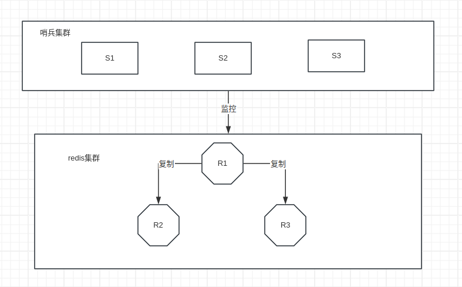
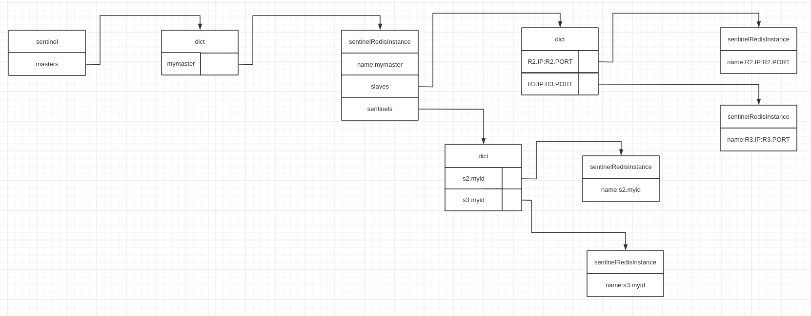

# 哨兵模式                                                                                                              

Redis的哨兵模式是指使用多个哨兵实例来监控和维护一个或多个Redis主从实例，以实现高可用性和故障恢复。哨兵模式通常由一个或多个哨兵进程组成，这些哨兵进程负责监控主服务器和从服务器的状态，并在主服务器宕机时自动选举一个新的主服务器。通过哨兵模式，可以实现Redis系统的自动故障转移和自动恢复。

要配置Redis的哨兵模式，您需要在redis.conf文件中为每个哨兵实例设置不同的端口和配置信息，并在各个哨兵实例的配置文件中指定要监控的主从Redis实例的信息。然后启动各个哨兵实例即可建立哨兵模式。哨兵之间会进行通讯，共同监控Redis实例的健康状况，并在需要时执行故障转移操作。

哨兵模式使得Redis集群能够更好地应对单点故障，并提高了整个系统的可靠性和稳定性。 

一个哨兵节点的配置示例如下

```
port 26379
daemonize yes
logfile "/var/log/redis/sentinel.log"
sentinel monitor mymaster 127.0.0.1 6379 2
sentinel down-after-milliseconds mymaster 60000
sentinel failover-timeout mymaster 180000
sentinel parallel-syncs mymaster 1
```

+ port：哨兵节点的端口号
+ daemonize：yes表示启用守护模式
+ logfile：日志文件
+ sentinel monitor：主节点信息，格式为 master-group-name、ip、port、quorum
  + master-group-name：主从集群名称，由用户定义，哨兵使用该名称标志该主从集群
  + ip、port：主节点的ip和端口
  + quorum：哨兵集群中必须存在不少于该数量的哨兵节点接受某个提议（主要是判断节点是否客观下线的场景），哨兵集群才能达成共识。该配置称为法定节点数
+ sentinel down-after-milliseconds：节点超过该配置时间未响应则判断主观下线
+ sentinel failover-timeout：哨兵节点必须在该时间内完成故障转移
+ sentinel parallel-syncs：故障转移过程中，最多有多少个从节点同时与晋升节点建立主从关系

## 实现原理

每个哨兵节点都维护一份自己视角下的当前哨兵集群状态，定义如下

```c
//src/sentinel.c
struct sentinelState {
    char myid[CONFIG_RUN_ID_SIZE+1]; /* This sentinel ID. *///区分不同的哨兵节点
    uint64_t current_epoch;         /* Current epoch. *///哨兵集群的当前任期号，用于故障转移时使用Raft算法选举leader节点
    dict *masters;      /* Dictionary of master sentinelRedisInstances.
                           Key is the instance name, value is the
                           sentinelRedisInstance structure pointer. *///键是集群名称，值是 sentinelRedisInstance
    int tilt;           /* Are we in TILT mode? *///当前哨兵节点是否处于TILT模式
    int running_scripts;    /* Number of scripts in execution right now. */
    mstime_t tilt_start_time;       /* When TITL started. */
    mstime_t previous_time;         /* Last time we ran the time handler. */
    list *scripts_queue;            /* Queue of user scripts to execute. */
    char *announce_ip;  /* IP addr that is gossiped to other sentinels if
                           not NULL. */
    int announce_port;  /* Port that is gossiped to other sentinels if
                           non zero. */
    unsigned long simfailure_flags; /* Failures simulation. */
    int deny_scripts_reconfig; /* Allow SENTINEL SET ... to change script
                                  paths at runtime? */
    char *sentinel_auth_pass;    /* Password to use for AUTH against other sentinel */
    char *sentinel_auth_user;    /* Username for ACLs AUTH against other sentinel. */
    int resolve_hostnames;       /* Support use of hostnames, assuming DNS is well configured. */
    int announce_hostnames;      /* Announce hostnames instead of IPs when we have them. */
} sentinel;//全局变量sentinel
```

sentinelRedisInstance 负责存储当前节点视图下的其他节点的实例数据，包括监控的主从节点，以及哨兵集群中的其他哨兵

```C
//src/sentinel.c
typedef struct sentinelRedisInstance {
    int flags;      /* See SRI_... defines */
    char *name;     /* Master name from the point of view of this sentinel. */
    char *runid;    /* Run ID of this instance, or unique ID if is a Sentinel.*/
    uint64_t config_epoch;  /* Configuration epoch. */
    sentinelAddr *addr; /* Master host. */
    instanceLink *link; /* Link to the instance, may be shared for Sentinels. */
    mstime_t last_pub_time;   /* Last time we sent hello via Pub/Sub. */
    mstime_t last_hello_time; /* Only used if SRI_SENTINEL is set. Last time
                                 we received a hello from this Sentinel
                                 via Pub/Sub. */
    /*...*/
}
```

+ flags：节点标志，存储了该节点的状态属性等信息（相关枚举值定义于src/sentinel.c）
+ name：主节点中是主从集群的名称，从节点中是 `ip:port`，哨兵节点中是 `myid`
+ runid：作为节点唯一标识的随机字符串，哨兵节点使用 myid，主从节点从个 INFO 命令的响应中获取 runid 作为该值，每个节点都会在启动时初始化 `server.runid` 作为节点标识（initServerConfig）函数，并在 INFO 的响应中返回该属性
+ link：instanceLink 实例，存储当前节点的连接信息
+ quorum：存储 sentinel monitor 中最后一个配置项，即法定节点数
+ down_after_period：存储 sentinel down-after-milliseconds 配置项，用于判断节点是否主观下线
+ parallel_syncs：存储 sentinel parallel-syncs 配置项，用于指定故障转移过程中最多有多少个从节点同时与晋升节点建立主从关系

以下是主节点实例专用字段

+ sentinels：存放集群中其他哨兵的节点实例
+ slaves：存放该主节点下所有的从节点

以下是从节点实例专用字段

+ slave_priority：从节点优先级，用于故障转移时选择从节点
+ slave_master_link_status：主从复制状态，保存 INFO 命令中的 master_link_status 属性
+ slave_repl_offset：主从复制偏移量，保存 INFO 命令中的 slave_repl_offset 属性

下面是故障转移专用字段

+ leader：如果是主节点，保存执行故障转移的哨兵的runid；如果是是哨兵节点，保存该节点票选为leader的哨兵节点的runid
+ leader_epoch：该节点票选的节点的任期号
+ failover_state：故障转移状态，故障转移过程中需要根据不同的状态执行不同的逻辑
+ failover_timeout：存储 sentinel failover-timeout 配置项
+ failover_epoch：当前已开始的故障转移的任期
+ config_epoch：写入配置的任期号，即故障转移已成功的任期号

哨兵集群中的节点在没有执行故障转移时都是平等的，当要执行故障转移时，哨兵集群会选出一个leader执行故障转移。选则leader的算法使用了Raft算法。

下面是一个集群例子



在上面的例子中，S1节点的 sentinel 变量如下图所示



sentinelRedisInstance.link 存储该节点与当前哨兵节点的连接信息

````c
//src/sentinel.c
typedef struct instanceLink {
    int refcount;          /* Number of sentinelRedisInstance owners. */
    int disconnected;      /* Non-zero if we need to reconnect cc or pc. */
    int pending_commands;  /* Number of commands sent waiting for a reply. */
    redisAsyncContext *cc; /* Hiredis context for commands. */
    redisAsyncContext *pc; /* Hiredis context for Pub / Sub. */
    /*...*/
} instanceLink;
````

+ cc：命令连接，哨兵节点需要与监控的主从节点、其他哨兵节点建立命令连接，以便给这些节点发送命令
+ pc：哨兵节点只与主从节点建立订阅连接，并从特定频道（__sentinel__:hello）中接收其他哨兵节点发送的信息
+ pc_last_activity：上次收到该节点频道数据的时间和
+ last_avail_time：上次收到该节点PING命令响应时间
+ last_ping_time：上次给该节点发送PING命令的时间
+ act_ping_time：上次给该节点发送PING（但是未收到响应的时间），收到响应后会置为0

### 哨兵启动

在 main 函数中，首先调用 `checkForSentinelMode` 判断是否启用哨兵模式，如果启用则设置 server.sentinel_mode，然后依次调用 `initSentinelConfig`、`initSentinel` 、`loadSentinelConfigFromQueue` 、`sentinelIsRunning` 初始化并启动哨兵机制

+ initSentinelConfig：修改端口号为 REDIS_SENTINEL_PORT（26379），取消保护模式
+ initSentinel：初始化 sentinel 变量
+ loadSentinelConfigFromQueue：解析哨兵配置，调用 **createSentinelRedisInstance** 为主节点创建 sentinelRedisInstance 实例，并添加到 sentinel.masters 中
+ sentinelIsRunning：检查 sentinel.myid 是否初始化，如果未初始化则随机赋值并写入配置文件

### 运行逻辑

serverCron 会检查 redis 是否运行在哨兵模式下，如果是则定义调用哨兵模式的定时函数 `sentinelTimer`

```C
//src/sentinel.c
void sentinelTimer(void) {
    sentinelCheckTiltCondition();//检查是否需要进入tilt
    sentinelHandleDictOfRedisInstances(sentinel.masters);//哨兵模式的主要逻辑
    sentinelRunPendingScripts();//定时执行哨兵脚本
    sentinelCollectTerminatedScripts();
    sentinelKillTimedoutScripts();

    /* We continuously change the frequency of the Redis "timer interrupt"
     * in order to desynchronize every Sentinel from every other.
     * This non-determinism avoids that Sentinels started at the same time
     * exactly continue to stay synchronized asking to be voted at the
     * same time again and again (resulting in nobody likely winning the
     * election because of split brain voting). */
    server.hz = CONFIG_DEFAULT_HZ + rand() % CONFIG_DEFAULT_HZ;//随机化下次的执行时间以避免故障转移过程中，使用raft算法选举leader节点时各节点同时发送投票请求
}
```

哨兵机制非常依赖系统时间。如果系统时间被修改或者进程阻塞导致时间不准确那么哨兵可能出现工作不正常的情况。为此，哨兵在每次执行sentinelTimer时都会检查是否需要进入 TILT模式。在这种模式下，哨兵继续监控其他节点，但是有以下区别：1）不再执行任何操作，比如故障转移；2）其他节点询问它对于某个主观下线的节点下线的判定结果时，它总是会返回未下线

```C
//src/sentinel.c
void sentinelCheckTiltCondition(void) {
    mstime_t now = mstime();
    mstime_t delta = now - sentinel.previous_time;//计算本次调用与上次调用之间的时间差

    if (delta < 0 || delta > sentinel_tilt_trigger) {//如果时间差是负值或者大于 sentinel_tilt_trigger（初始值为2000），则进入 TILT 模式
        sentinel.tilt = 1;
        sentinel.tilt_start_time = mstime();
        sentinelEvent(LL_WARNING,"+tilt",NULL,"#tilt mode entered");
    }
    sentinel.previous_time = mstime();
}
```

哨兵节点在 TILT 模式下正常运行30秒后会退出TILT模式

`sentinelHandleDictOfRedisInstances` 中包含了哨兵模式的主逻辑

```C
//src/sentinel.c
/*
	该函数会递归处理 sentinel.masters 中的 sentinelRedisInstance 实例
*/
void sentinelHandleDictOfRedisInstances(dict *instances) {
    dictIterator *di;
    dictEntry *de;
    sentinelRedisInstance *switch_to_promoted = NULL;

    /* There are a number of things we need to perform against every master. */
    di = dictGetIterator(instances);//遍历 instances，调用 sentinelHandleRedisInstance 进行处理
    while((de = dictNext(di)) != NULL) {
        sentinelRedisInstance *ri = dictGetVal(de);

        sentinelHandleRedisInstance(ri);
        if (ri->flags & SRI_MASTER) {//如果当前处理的是 master 节点，则继续处理对应的从节点和哨兵节点
            sentinelHandleDictOfRedisInstances(ri->slaves);
            sentinelHandleDictOfRedisInstances(ri->sentinels);
            if (ri->failover_state == SENTINEL_FAILOVER_STATE_UPDATE_CONFIG) {
                switch_to_promoted = ri;
            }
        }
    }
    if (switch_to_promoted)//switch_to_promoted为真说明哨兵对该节点执行了故障转移，这里完成故障转移的最后一步
        sentinelFailoverSwitchToPromotedSlave(switch_to_promoted);
    dictReleaseIterator(di);
}

void sentinelHandleRedisInstance(sentinelRedisInstance *ri) {
    /* ========== MONITORING HALF ============ */
    /* Every kind of instance */
    sentinelReconnectInstance(ri);//负责建立当前节点与目标节点的连接
    sentinelSendPeriodicCommands(ri);//负责给目标节点发送定时信息

    /* ============== ACTING HALF ============= */
    /* We don't proceed with the acting half if we are in TILT mode.
     * TILT happens when we find something odd with the time, like a
     * sudden change in the clock. */
    if (sentinel.tilt) {//检查距离进入TILT模式的时间，达到要求则退出
        if (mstime()-sentinel.tilt_start_time < sentinel_tilt_period) return;
        sentinel.tilt = 0;
        sentinelEvent(LL_WARNING,"-tilt",NULL,"#tilt mode exited");
    }

    /* Every kind of instance */
    sentinelCheckSubjectivelyDown(ri);//检查是否存在主观下线

    /* Masters and slaves */
    if (ri->flags & (SRI_MASTER|SRI_SLAVE)) {
        /* Nothing so far. */
    }

    /* Only masters */
    if (ri->flags & SRI_MASTER) {//以下逻辑针对主节点
        sentinelCheckObjectivelyDown(ri);//检查是否存在客观下线
        if (sentinelStartFailoverIfNeeded(ri))//检查是否可以进行故障转移
            sentinelAskMasterStateToOtherSentinels(ri,SENTINEL_ASK_FORCED);//发起投票
        sentinelFailoverStateMachine(ri);//实现故障转移状态机，实现故障转移逻辑
        sentinelAskMasterStateToOtherSentinels(ri,SENTINEL_NO_FLAGS);//发送询问请求，询问其他节点对该主节点主观下线的判断结果
    }
}
```

#### 建立网络连接

`sentinelReconnectInstance` 负责建立当前节点与其他节点 的网络连接，以及连接断开之后的重连

```C
//src/sentinel.c
/*
	负责与redis集群以及哨兵集群中的其他哨兵建立连接，使用了 hiredis 库提供的 api
*/
void sentinelReconnectInstance(sentinelRedisInstance *ri) {

    if (ri->link->disconnected == 0) return;
    if (ri->addr->port == 0) return; /* port == 0 means invalid address. */
    instanceLink *link = ri->link;
    mstime_t now = mstime();

    if (now - ri->link->last_reconn_time < sentinel_ping_period) return;
    ri->link->last_reconn_time = now;

    /* Commands connection. */
    if (link->cc == NULL) {//创建命令连接

        /* It might be that the instance is disconnected because it wasn't available earlier when the instance
         * allocated, say during failover, and therefore we failed to resolve its ip.
         * Another scenario is that the instance restarted with new ip, and we should resolve its new ip based on
         * its hostname */
        if (sentinel.resolve_hostnames) {
            sentinelAddr *tryResolveAddr = createSentinelAddr(ri->addr->hostname, ri->addr->port, 0);
            if (tryResolveAddr != NULL) {
                releaseSentinelAddr(ri->addr);
                ri->addr = tryResolveAddr;
            }
        }

        link->cc = redisAsyncConnectBind(ri->addr->ip,ri->addr->port,server.bind_source_addr);

        /*...*/
    }
    /* Pub / Sub */
    if ((ri->flags & (SRI_MASTER|SRI_SLAVE)) && link->pc == NULL) {//如果是主从节点，则创建订阅连接，订阅的频道为 __sentinel__:hello
        link->pc = redisAsyncConnectBind(ri->addr->ip,ri->addr->port,server.bind_source_addr);
        if (link->pc && !link->pc->err) anetCloexec(link->pc->c.fd);
        if (!link->pc) {
            /*...*/
        } else {
            /*...*/
            /* Now we subscribe to the Sentinels "Hello" channel. */
            retval = redisAsyncCommand(link->pc,
                sentinelReceiveHelloMessages, ri, "%s %s",
                sentinelInstanceMapCommand(ri,"SUBSCRIBE"),
                SENTINEL_HELLO_CHANNEL);//注册回调函数，负责处理哨兵频道收到的数据
            if (retval != C_OK) {
                /* If we can't subscribe, the Pub/Sub connection is useless
                 * and we can simply disconnect it and try again. */
                instanceLinkCloseConnection(link,link->pc);
                return;
            }
        }
    }
    /* Clear the disconnected status only if we have both the connections
     * (or just the commands connection if this is a sentinel instance). */
    if (link->cc && (ri->flags & SRI_SENTINEL || link->pc))
        link->disconnected = 0;
}
```

可以看到，当前哨兵与redis集群中的节点建立命令连接、订阅连接（订阅的频道为 __sentinel__:hello，哨兵从该频道获取哨兵集群中其他哨兵的信息），与哨兵集群中的其他节点建立命令连接

#### 定时消息

sentinelSendPeriodicCommands 负责定时向主从节点和其他哨兵节点发送消息

```C
//src/sentinel.c
void sentinelSendPeriodicCommands(sentinelRedisInstance *ri) {
    mstime_t now = mstime();
    mstime_t info_period, ping_period;
    int retval;

    /*...*/

    /* If this is a slave of a master in O_DOWN condition we start sending
     * it INFO every second, instead of the usual SENTINEL_INFO_PERIOD
     * period. In this state we want to closely monitor slaves in case they
     * are turned into masters by another Sentinel, or by the sysadmin.
     *
     * Similarly we monitor the INFO output more often if the slave reports
     * to be disconnected from the master, so that we can have a fresh
     * disconnection time figure. *///如果当前节点是从节点，并且主节点处于故障转移或者客观下线状态，或者从节点报告主节点已下线，则调整向从节点发送INFO的周期为1s，否则为10s
    if ((ri->flags & SRI_SLAVE) &&
        ((ri->master->flags & (SRI_O_DOWN|SRI_FAILOVER_IN_PROGRESS)) ||
         (ri->master_link_down_time != 0)))
    {
        info_period = 1000;
    } else {
        info_period = sentinel_info_period;
    }

    /* We ping instances every time the last received pong is older than
     * the configured 'down-after-milliseconds' time, but every second
     * anyway if 'down-after-milliseconds' is greater than 1 second. */
    ping_period = ri->down_after_period;
    if (ping_period > sentinel_ping_period) ping_period = sentinel_ping_period;

    /* Send INFO to masters and slaves, not sentinels. */
    if ((ri->flags & SRI_SENTINEL) == 0 &&
        (ri->info_refresh == 0 ||
        (now - ri->info_refresh) > info_period))//向主从节点发送INFO命令，并注册sentinelInfoReplyCallback为回调函数
    {
        retval = redisAsyncCommand(ri->link->cc,
            sentinelInfoReplyCallback, ri, "%s",
            sentinelInstanceMapCommand(ri,"INFO"));
        if (retval == C_OK) ri->link->pending_commands++;
    }

    /* Send PING to all the three kinds of instances. */
    if ((now - ri->link->last_pong_time) > ping_period &&//向所有节点发送PING
               (now - ri->link->last_ping_time) > ping_period/2) {
        sentinelSendPing(ri);
    }

    /* PUBLISH hello messages to all the three kinds of instances. *///向所有节点的哨兵频道发送信息，间隔为s
    if ((now - ri->last_pub_time) > sentinel_publish_period) {
        sentinelSendHello(ri);
    }
}
```

INFO命令的响应中会包含主从节点的信息，哨兵节点会对收到的响应进行解析，如果发现解析结果中发现 slaves 中不存在的从节点，则会调用`createSentinelRedisInstance` 为该从节点创建 `sentinelRedisInstance` 实例并添加到 slaves 字典中

哨兵频道的消息包含以下信息

```
sentinel_ip,sentinel_port,sentinel_runid,current_epoch,
master_name,master_ip,master_port,master_config_epoch.
```

我们知道，哨兵节点会订阅主从节点的哨兵频道。当从哨兵频道收到消息后，哨兵节点会调用 `sentinelReceiveHelloMessages` 进行处理（对于自身发送的消息直接抛弃）。如果发现 sentinels 中不存在的哨兵节点，则调用 `createSentinelRedisInstance` 为该哨兵节点创建实例并添加到 sentinels 字典中。可以看到，虽然配置文件中只有主节点的信息，哨兵节点从INFO命令中获取了从节点的信息，从哨兵频道获取了其他哨兵的信息，最终拥有了整个受监控的 redis 集群和哨兵集群的完整信息

## 故障转移

故障转移是哨兵集群的主要功能。该过程分为两步：

1. 主观下线——如果某个节点超时未响应，则哨兵节点可以判定该节点主观下线，代表该哨兵节点认为该节点已经下线
2. 客观下线——哨兵集群中判定该节点主观下线的节点数量不少于法定节点数（quorum配置），代表哨兵集群达成了该节点下线的共识即该节点已经客观下线

### 主观下线

redis 通过调用 `sentinelCheckSubjectivelyDown` 检查是否存在主观下线

```C
//src/sentinel.c
/*
+ pc_last_activity：上次收到该节点频道数据的时间
+ last_avail_time：上次收到该节点PING命令有效响应的时间
+ last_pong_time：上次收到该节点PING命令响应的时间
+ last_ping_time：上次给该节点发送PING命令的时间
+ act_ping_time：上次给该节点发送PING（但是未收到响应的时间），收到响应后会置为0
*/
void sentinelCheckSubjectivelyDown(sentinelRedisInstance *ri) {
    mstime_t elapsed = 0;
	//计算上次给目标节点发送PING后过去的时间或者收到有效PING响应的时间
    if (ri->link->act_ping_time)
        elapsed = mstime() - ri->link->act_ping_time;
    else if (ri->link->disconnected)
        elapsed = mstime() - ri->link->last_avail_time;

    /* Check if we are in need for a reconnection of one of the
     * links, because we are detecting low activity.
     *
     * 1) Check if the command link seems connected, was connected not less
     *    than SENTINEL_MIN_LINK_RECONNECT_PERIOD, but still we have a
     *    pending ping for more than half the timeout. *///满足以下条件则断开命令连接，等待 sentinelReconnectInstance 重连
    if (ri->link->cc &&
        (mstime() - ri->link->cc_conn_time) >
        sentinel_min_link_reconnect_period &&
        ri->link->act_ping_time != 0 && /* There is a pending ping... */
        /* The pending ping is delayed, and we did not receive
         * error replies as well. */
        (mstime() - ri->link->act_ping_time) > (ri->down_after_period/2) &&
        (mstime() - ri->link->last_pong_time) > (ri->down_after_period/2))
    {
        instanceLinkCloseConnection(ri->link,ri->link->cc);
    }

    /* 2) Check if the pubsub link seems connected, was connected not less
     *    than SENTINEL_MIN_LINK_RECONNECT_PERIOD, but still we have no
     *    activity in the Pub/Sub channel for more than
     *    SENTINEL_PUBLISH_PERIOD * 3.
     *///满足以下条件册断开订阅连接，等待 sentinelReconnectInstance 重连
    if (ri->link->pc &&
        (mstime() - ri->link->pc_conn_time) >
         sentinel_min_link_reconnect_period &&
        (mstime() - ri->link->pc_last_activity) > (sentinel_publish_period*3))
    {
        instanceLinkCloseConnection(ri->link,ri->link->pc);
    }

    /* Update the SDOWN flag. We believe the instance is SDOWN if:
     *
     * 1) It is not replying.
     * 2) We believe it is a master, it reports to be a slave for enough time
     *    to meet the down_after_period, plus enough time to get two times
     *    INFO report from the instance. *///满足以下任意条件则判断该节点主观下线：1）elapsed 超过该节点的down_after_period；2）哨兵节点认为该节点是主节点，但是该节点在INFO响应中报告自己是从节点，并且距离其报告自己是从节点已经过去了足够长的时间；3）该节点是主节点正在重启，并且重启经过的时间已经超过了 master_reboot_down_after_period
    if (elapsed > ri->down_after_period ||
        (ri->flags & SRI_MASTER &&
         ri->role_reported == SRI_SLAVE &&
         mstime() - ri->role_reported_time >
          (ri->down_after_period+sentinel_info_period*2)) ||
          (ri->flags & SRI_MASTER_REBOOT && 
           mstime()-ri->master_reboot_since_time > ri->master_reboot_down_after_period))
    {
        /* Is subjectively down *///设这该节点为 SRI_S_DOWN
        if ((ri->flags & SRI_S_DOWN) == 0) {
            sentinelEvent(LL_WARNING,"+sdown",ri,"%@");
            ri->s_down_since_time = mstime();
            ri->flags |= SRI_S_DOWN;
        }
    } else {
        /* Is subjectively up *///上述条件不满足，清除 SRI_S_DOWN 标记
        if (ri->flags & SRI_S_DOWN) {
            sentinelEvent(LL_WARNING,"-sdown",ri,"%@");
            ri->flags &= ~(SRI_S_DOWN|SRI_SCRIPT_KILL_SENT);
        }
    }
}
```

### 客观下线

哨兵运行逻辑中会针对主节点调用 `sentinelAskMasterStateToOtherSentinels(ri,SENTINEL_NO_FLAGS)` 询问其他哨兵节点对该节点主观下线的判断情况。其他哨兵节点会恢复一个 isdown 标识，如果该标志为1标识该哨兵节点判断该节点主观下线。此时，当前哨兵节点会找到该哨兵节点对应的实例，给该实例添加 `SRI_MASTER_DOWN` 标志，代表该哨兵节点判断该节点主观下线。

```C
//src/sentinel.c
void sentinelCheckObjectivelyDown(sentinelRedisInstance *master) {
    dictIterator *di;
    dictEntry *de;
    unsigned int quorum = 0, odown = 0;

    if (master->flags & SRI_S_DOWN) {
        /* Is down for enough sentinels? */
        quorum = 1; /* the current sentinel. */
        /* Count all the other sentinels. */
        di = dictGetIterator(master->sentinels);//遍历所有哨兵节点
        while((de = dictNext(di)) != NULL) {
            sentinelRedisInstance *ri = dictGetVal(de);

            if (ri->flags & SRI_MASTER_DOWN) quorum++;//增加quorum计数
        }
        dictReleaseIterator(di);
        if (quorum >= master->quorum) odown = 1;//判断是否满足客观下线条件
    }

    /* Set the flag accordingly to the outcome. */
    if (odown) {//设置客观下线标志
        if ((master->flags & SRI_O_DOWN) == 0) {
            sentinelEvent(LL_WARNING,"+odown",master,"%@ #quorum %d/%d",
                quorum, master->quorum);
            master->flags |= SRI_O_DOWN;
            master->o_down_since_time = mstime();
        }
    } else {
        if (master->flags & SRI_O_DOWN) {
            sentinelEvent(LL_WARNING,"-odown",master,"%@");
            master->flags &= ~SRI_O_DOWN;
        }
    }
}
```

### 故障转移

检查是否存在客观下线以后，调用 `sentinelStartFailoverIfNeeded` 开始判断能否进行故障转移

```C
//src/sentinel.c
int sentinelStartFailoverIfNeeded(sentinelRedisInstance *master) {
    /* We can't failover if the master is not in O_DOWN state. */
    if (!(master->flags & SRI_O_DOWN)) return 0;//如果目标节点不是客观下线状态则退出

    /* Failover already in progress? */
    if (master->flags & SRI_FAILOVER_IN_PROGRESS) return 0;

    /* Last failover attempt started too little time ago? *///failover_start_time记录了上次开始故障转移或者给其他哨兵节点投票的时间
    if (mstime() - master->failover_start_time <//这里要求本次故障转移距离上次故障转移必须超过 failover_timeout（默认为180000毫秒，即3分钟） 的两倍才能开始
        master->failover_timeout*2)
    {
        if (master->failover_delay_logged != master->failover_start_time) {
            time_t clock = (master->failover_start_time +
                            master->failover_timeout*2) / 1000;
            char ctimebuf[26];

            ctime_r(&clock,ctimebuf);
            ctimebuf[24] = '\0'; /* Remove newline. */
            master->failover_delay_logged = master->failover_start_time;
            serverLog(LL_NOTICE,
                "Next failover delay: I will not start a failover before %s",
                ctimebuf);
        }
        return 0;
    }

    sentinelStartFailover(master);//可以进行故障转移，开启故障转移流程
    return 1;
}

void sentinelStartFailover(sentinelRedisInstance *master) {
    serverAssert(master->flags & SRI_MASTER);
	//设置相关状态
    master->failover_state = SENTINEL_FAILOVER_STATE_WAIT_START;
    master->flags |= SRI_FAILOVER_IN_PROGRESS;
    master->failover_epoch = ++sentinel.current_epoch;//当前任期加1,并赋给目标实例的failover_epoch，标识当前任期正在进行故障转移
    sentinelEvent(LL_WARNING,"+new-epoch",master,"%llu",
        (unsigned long long) sentinel.current_epoch);
    sentinelEvent(LL_WARNING,"+try-failover",master,"%@");
    master->failover_start_time = mstime()+rand()%SENTINEL_MAX_DESYNC;//当前哨兵节点开始故障转移或者投票给其他节点时都要更新该属性
    master->failover_state_change_time = mstime();
}
```

### 选举leader节点

故障转移之前，首先要选举leader节点

#### 发送请求

根据传递参数的不同，`sentinelAskMasterStateToOtherSentinels` 执行两个逻辑：查询主节点状态或者发送投票请求，要求其他节点给自己投票

```C
//src/sentinel.c
#define SENTINEL_ASK_FORCED (1<<0)
void sentinelAskMasterStateToOtherSentinels(sentinelRedisInstance *master, int flags) {
    dictIterator *di;
    dictEntry *de;

    di = dictGetIterator(master->sentinels);
    while((de = dictNext(di)) != NULL) {//遍历所有哨兵节点
        sentinelRedisInstance *ri = dictGetVal(de);
        mstime_t elapsed = mstime() - ri->last_master_down_reply_time;
        char port[32];
        int retval;

        /* If the master state from other sentinel is too old, we clear it. */
        if (elapsed > sentinel_ask_period*5) {
            ri->flags &= ~SRI_MASTER_DOWN;
            sdsfree(ri->leader);
            ri->leader = NULL;
        }

        /* Only ask if master is down to other sentinels if:
         *
         * 1) We believe it is down, or there is a failover in progress.
         * 2) Sentinel is connected.
         * 3) We did not receive the info within SENTINEL_ASK_PERIOD ms. */
        if ((master->flags & SRI_S_DOWN) == 0) continue;
        if (ri->link->disconnected) continue;
        if (!(flags & SENTINEL_ASK_FORCED) &&
            mstime() - ri->last_master_down_reply_time < sentinel_ask_period)
            continue;

        /* Ask */
        ll2string(port,sizeof(port),master->addr->port);
        retval = redisAsyncCommand(ri->link->cc,
                    sentinelReceiveIsMasterDownReply, ri,
                    "%s is-master-down-by-addr %s %s %llu %s",
                    sentinelInstanceMapCommand(ri,"SENTINEL"),
                    announceSentinelAddr(master->addr), port,
                    sentinel.current_epoch,
                    (master->failover_state > SENTINEL_FAILOVER_STATE_NONE) ?//这里，如果已经开始故障转移，则最后一个参数为当前哨兵节点的myid，表示这是一次投票请求，否则发送*表示这是一次查询请求
                    sentinel.myid : "*");
        if (retval == C_OK) ri->link->pending_commands++;
    }
    dictReleaseIterator(di);
} 
```

#### 投票

sentinel 命令的处理函数为 `sentinelCommand`，这里只需要关注 `IS-MASTER-DOWN-BY-ADDR` 子命令的处理

```C
//src/sentinel.c
void sentinelCommand(client *c) {
else if (!strcasecmp(c->argv[1]->ptr,"is-master-down-by-addr")) {
        /* SENTINEL IS-MASTER-DOWN-BY-ADDR <ip> <port> <current-epoch> <runid>
         *
         * Arguments:
         *
         * ip and port are the ip and port of the master we want to be
         * checked by Sentinel. Note that the command will not check by
         * name but just by master, in theory different Sentinels may monitor
         * different masters with the same name.
         *
         * current-epoch is needed in order to understand if we are allowed
         * to vote for a failover leader or not. Each Sentinel can vote just
         * one time per epoch.
         *
         * runid is "*" if we are not seeking for a vote from the Sentinel
         * in order to elect the failover leader. Otherwise it is set to the
         * runid we want the Sentinel to vote if it did not already voted.
         */
        sentinelRedisInstance *ri;
        long long req_epoch;
        uint64_t leader_epoch = 0;
        char *leader = NULL;
        long port;
        int isdown = 0;

        if (c->argc != 6) goto numargserr;
        if (getLongFromObjectOrReply(c,c->argv[3],&port,NULL) != C_OK ||
            getLongLongFromObjectOrReply(c,c->argv[4],&req_epoch,NULL)
                                                              != C_OK)
            return;
        ri = getSentinelRedisInstanceByAddrAndRunID(sentinel.masters,
            c->argv[2]->ptr,port,NULL);//根据参数中的ip和端口号获取master节点实例

        /* It exists? Is actually a master? Is subjectively down? It's down.
         * Note: if we are in tilt mode we always reply with "0". */
        if (!sentinel.tilt && ri && (ri->flags & SRI_S_DOWN) &&
                                    (ri->flags & SRI_MASTER))
            isdown = 1;

        /* Vote for the master (or fetch the previous vote) if the request
         * includes a runid, otherwise the sender is not seeking for a vote. */
        if (ri && ri->flags & SRI_MASTER && strcasecmp(c->argv[5]->ptr,"*")) {//根据发送的是myid还是*判断请求类型
            leader = sentinelVoteLeader(ri,(uint64_t)req_epoch,//如果是选举请求，则尝试给发送节点投票，如果同意投票则返回发起节点的 myid
                                            c->argv[5]->ptr,
                                            &leader_epoch);
        }

        /* Reply with a three-elements multi-bulk reply:
         * down state, leader, vote epoch. *///向发送节点返回应答
        addReplyArrayLen(c,3);
        addReply(c, isdown ? shared.cone : shared.czero);//下线标识，如果目标节点在接收节点中已经被判定为主观下线则为1，否则为0
        addReplyBulkCString(c, leader ? leader : "*");//接收节点最新投票的节点的myid属性，*表示空
        addReplyLongLong(c, (long long)leader_epoch);//接收节点最新投票的节点的任期
        if (leader) sdsfree(leader);
}

/*
	负责判断是否可以给发送节点投票
	master：目标节点
	req_epoch、req_runid：发送节点命令参数中的 sentinel.current_epoch、sentinel.myid
	leader_epoch：记录获得接收节点投票的最新节点的任期
*/
char *sentinelVoteLeader(sentinelRedisInstance *master, uint64_t req_epoch, char *req_runid, uint64_t *leader_epoch) {
    if (req_epoch > sentinel.current_epoch) {//如果发送节点的 current_epoch 比接收节点的 current_epoch 大，则更新接收节点的 current_epoch 属性并写入配置文件
        sentinel.current_epoch = req_epoch;
        sentinelFlushConfig();
        sentinelEvent(LL_WARNING,"+new-epoch",master,"%llu",
            (unsigned long long) sentinel.current_epoch);
    }
	//满足以下条件则给该发送节点投票：当前节点的最新投票任期 master->leader_epoch 小于发送节点的任期 req_epoch 并且当前接收节点的任期小于等于发送节点的任期
    if (master->leader_epoch < req_epoch && sentinel.current_epoch <= req_epoch)
    {
        sdsfree(master->leader);
        master->leader = sdsnew(req_runid);//更新 leader 为发送节点的 myid
        master->leader_epoch = sentinel.current_epoch;//更新 leader_epoch
        sentinelFlushConfig();//更新配置文件
        sentinelEvent(LL_WARNING,"+vote-for-leader",master,"%s %llu",
            master->leader, (unsigned long long) master->leader_epoch);
        /* If we did not voted for ourselves, set the master failover start
         * time to now, in order to force a delay before we can start a
         * failover for the same master. */
        if (strcasecmp(master->leader,sentinel.myid))//不相等说明给其他节点投票
            master->failover_start_time = mstime()+rand()%SENTINEL_MAX_DESYNC;//更新 failover_start_time 避免段时间内重复发起故障转移
    }

    *leader_epoch = master->leader_epoch;
    return master->leader ? sdsnew(master->leader) : NULL;
}
```

#### 统计投票结果

发送节点收到投票应答之后，会调用 `sentinelReceiveIsMasterDownReply` 统计投票结果（该函数为发送投票请求时设置的回调函数）

```C
//src/sentinel.c
void sentinelReceiveIsMasterDownReply(redisAsyncContext *c, void *reply, void *privdata) {
    sentinelRedisInstance *ri = privdata;//接收节点的实例
    instanceLink *link = c->data;
    redisReply *r;

    if (!reply || !link) return;
    link->pending_commands--;
    r = reply;

    /* Ignore every error or unexpected reply.
     * Note that if the command returns an error for any reason we'll
     * end clearing the SRI_MASTER_DOWN flag for timeout anyway. */
    if (r->type == REDIS_REPLY_ARRAY && r->elements == 3 &&
        r->element[0]->type == REDIS_REPLY_INTEGER &&
        r->element[1]->type == REDIS_REPLY_STRING &&
        r->element[2]->type == REDIS_REPLY_INTEGER)
    {
        ri->last_master_down_reply_time = mstime();
        if (r->element[0]->integer == 1) {//记录接收节点对主节点状态的判断
            ri->flags |= SRI_MASTER_DOWN;
        } else {
            ri->flags &= ~SRI_MASTER_DOWN;
        }
        if (strcmp(r->element[1]->str,"*")) {//第二个参数不是*说明这是投票应答，记录接收节点的投票结果，包括被投票节点的myid和任期号
            /* If the runid in the reply is not "*" the Sentinel actually
             * replied with a vote. */
            sdsfree(ri->leader);
            if ((long long)ri->leader_epoch != r->element[2]->integer)
                serverLog(LL_NOTICE,
                    "%s voted for %s %llu", ri->name,
                    r->element[1]->str,
                    (unsigned long long) r->element[2]->integer);
            ri->leader = sdsnew(r->element[1]->str);
            ri->leader_epoch = r->element[2]->integer;
        }
    }
}
```

#### 故障转移状态机

经过投票操作之后，哨兵集群因该已经选出当前任期下的唯一一个 leader，开始执行故障转移状态机

```C
//src/sentinel.c
void sentinelFailoverStateMachine(sentinelRedisInstance *ri) {
    serverAssert(ri->flags & SRI_MASTER);

    if (!(ri->flags & SRI_FAILOVER_IN_PROGRESS)) return;//未执行故障转移则直接退出

    switch(ri->failover_state) {//根据目标节点状态执行相应操作
        case SENTINEL_FAILOVER_STATE_WAIT_START://统计投票结果
            sentinelFailoverWaitStart(ri);
            break;
        case SENTINEL_FAILOVER_STATE_SELECT_SLAVE://选择晋升的从节点
            sentinelFailoverSelectSlave(ri);
            break;
        case SENTINEL_FAILOVER_STATE_SEND_SLAVEOF_NOONE://选择的从节点晋升为主节点
            sentinelFailoverSendSlaveOfNoOne(ri);
            break;
        case SENTINEL_FAILOVER_STATE_WAIT_PROMOTION://等待上一步完成
            sentinelFailoverWaitPromotion(ri);
            break;
        case SENTINEL_FAILOVER_STATE_RECONF_SLAVES://其他从节点与晋升的从节点建立主从关系
            sentinelFailoverReconfNextSlave(ri);
            break;
    }
}
```

##### 统计投票结果

`sentinelFailoverWaitStart` 负责统计当前任期的选举投票结果

```C
//src/sentinel.c
void sentinelFailoverWaitStart(sentinelRedisInstance *ri) {
    char *leader;
    int isleader;

    /* Check if we are the leader for the failover epoch. */
    leader = sentinelGetLeader(ri, ri->failover_epoch);//统计当前任期的投票结果，返回leader节点的myid属性
    isleader = leader && strcasecmp(leader,sentinel.myid) == 0;
    sdsfree(leader);

    /* If I'm not the leader, and it is not a forced failover via
     * SENTINEL FAILOVER, then I can't continue with the failover. */
    if (!isleader && !(ri->flags & SRI_FORCE_FAILOVER)) {//当前节点不是leader节点并且没有强制执行故障恢复
        mstime_t election_timeout = sentinel_election_timeout;

        /* The election timeout is the MIN between SENTINEL_ELECTION_TIMEOUT
         * and the configured failover timeout. */
        if (election_timeout > ri->failover_timeout)
            election_timeout = ri->failover_timeout;
        /* Abort the failover if I'm not the leader after some time. */
        if (mstime() - ri->failover_start_time > election_timeout) {//这里判断本次选举是否超时，条件是开始故障恢复迄今为止的时间是否超过选举超时时间（ri->failover_timeout 和 sentinel_election_timeout 中的较小的值），如果超时则终止本次故障恢复
            sentinelEvent(LL_WARNING,"-failover-abort-not-elected",ri,"%@");
            sentinelAbortFailover(ri);
        }
        return;
    }
    sentinelEvent(LL_WARNING,"+elected-leader",ri,"%@");
    if (sentinel.simfailure_flags & SENTINEL_SIMFAILURE_CRASH_AFTER_ELECTION)
        sentinelSimFailureCrash();
    ri->failover_state = SENTINEL_FAILOVER_STATE_SELECT_SLAVE;//当前哨兵被选举为 leader 则进入下一个状态选择哪个从节点进行晋升
    ri->failover_state_change_time = mstime();
    sentinelEvent(LL_WARNING,"+failover-state-select-slave",ri,"%@");
}


/*
	统计投票结果
*/
char *sentinelGetLeader(sentinelRedisInstance *master, uint64_t epoch) {
    dict *counters;
    dictIterator *di;
    dictEntry *de;
    unsigned int voters = 0, voters_quorum;
    char *myvote;
    char *winner = NULL;
    uint64_t leader_epoch;
    uint64_t max_votes = 0;

    serverAssert(master->flags & (SRI_O_DOWN|SRI_FAILOVER_IN_PROGRESS));
    counters = dictCreate(&leaderVotesDictType);//字典，key 是 myid，value 是得票数

    voters = dictSize(master->sentinels)+1; /* All the other sentinels and me.*/

    /* Count other sentinels votes */
    di = dictGetIterator(master->sentinels);//这里遍历所有哨兵节点统计当前任期下的得票数
    while((de = dictNext(di)) != NULL) {
        sentinelRedisInstance *ri = dictGetVal(de);
        if (ri->leader != NULL && ri->leader_epoch == sentinel.current_epoch)
            sentinelLeaderIncr(counters,ri->leader);
    }
    dictReleaseIterator(di);

    /* Check what's the winner. For the winner to win, it needs two conditions:
     * 1) Absolute majority between voters (50% + 1).
     * 2) And anyway at least master->quorum votes. */
    di = dictGetIterator(counters);
    while((de = dictNext(di)) != NULL) {//找到得票最多的哨兵节点
        uint64_t votes = dictGetUnsignedIntegerVal(de);

        if (votes > max_votes) {
            max_votes = votes;
            winner = dictGetKey(de);
        }
    }
    dictReleaseIterator(di);

    /* Count this Sentinel vote:
     * if this Sentinel did not voted yet, either vote for the most
     * common voted sentinel, or for itself if no vote exists at all. */
    if (winner)//如果选出得票最多的节点，则向其投票，否则给自己投票
        myvote = sentinelVoteLeader(master,epoch,winner,&leader_epoch);
    else
        myvote = sentinelVoteLeader(master,epoch,sentinel.myid,&leader_epoch);

    if (myvote && leader_epoch == epoch) {//投票成功则再次选择 winner
        uint64_t votes = sentinelLeaderIncr(counters,myvote);

        if (votes > max_votes) {
            max_votes = votes;
            winner = myvote;
        }
    }

    voters_quorum = voters/2+1;//选举leader成功的条件：得票数不少于法定节点数并且超过哨兵节点数量的一半
    if (winner && (max_votes < voters_quorum || max_votes < master->quorum))
        winner = NULL;

    winner = winner ? sdsnew(winner) : NULL;
    sdsfree(myvote);
    dictRelease(counters);
    return winner;//返回选举得到的 leader
}
```

##### 选择从节点

选出 leader 之后，leader 节点会调用 `sentinelFailoverSelectSlave` 选择一个从节点，使其晋升为主节点，晋升规则为：

1. 按照以下规则进行过滤：

   + 过滤主观下线和客观下线的节点
   + 过滤命令连接或者订阅连接断开的节点
   + 过滤超过 sentinel_ping_period*5 没有响应 PING 命令的节点
   + 过滤 slave_priority 为0的节点
   + 过滤太久没有响应 INFO 命令的节点
   + 过滤主从连接断开太久的节点

2.  使用上面过滤后剩余的节点，使用 `compareSlavesForPromotion` 作为比较函数进行排序，排序比较顺序为 slave_priority、slave_repl_offset、runid

   选出待晋升的从节点之后，给其 flags 添加 SRI_PROMOTED 标记，并记录在 ri->promoted_slave 中

##### 晋升节点

`sentinelFailoverSendSlaveOfNoOne` 向被选中的从节点发送 `SLAVEOF NO ONE` 命令使其转变为 master

##### 等待晋升完成

`sentinelFailoverWaitPromotion` 中除了检查故障转移是否超时以外没有做其他操作，这里状态变化是 `sentinelRefreshInstanceInfo` 中完成的

```C
//sentinelRefreshInstanceInfo
void sentinelRefreshInstanceInfo(sentinelRedisInstance *ri, const char *info) {
    /*...*/
    if ((ri->flags & SRI_SLAVE) && role == SRI_MASTER) {//如果当前哨兵节点认为某个节点是从节点，但是其报告字节是主节点，说明该主节点是由从节点切换而来
        /* If this is a promoted slave we can change state to the
         * failover state machine. *///满足下列条件说明该从节点晋升完成
        if ((ri->flags & SRI_PROMOTED) &&
            (ri->master->flags & SRI_FAILOVER_IN_PROGRESS) &&
            (ri->master->failover_state ==
                SENTINEL_FAILOVER_STATE_WAIT_PROMOTION))
        {
            /* Now that we are sure the slave was reconfigured as a master
             * set the master configuration epoch to the epoch we won the
             * election to perform this failover. This will force the other
             * Sentinels to update their config (assuming there is not
             * a newer one already available). */
            ri->master->config_epoch = ri->master->failover_epoch;
            ri->master->failover_state = SENTINEL_FAILOVER_STATE_RECONF_SLAVES;//状态机转换到下一个状态
            ri->master->failover_state_change_time = mstime();
            sentinelFlushConfig();//更新配置文件
            sentinelEvent(LL_WARNING,"+promoted-slave",ri,"%@");
            if (sentinel.simfailure_flags &
                SENTINEL_SIMFAILURE_CRASH_AFTER_PROMOTION)
                sentinelSimFailureCrash();
            sentinelEvent(LL_WARNING,"+failover-state-reconf-slaves",
                ri->master,"%@");
            sentinelCallClientReconfScript(ri->master,SENTINEL_LEADER,
                "start",ri->master->addr,ri->addr);
            sentinelForceHelloUpdateForMaster(ri->master);
        }
    }
    /*...*/
}
```

##### 建立主从关系

从节点晋升完成之后，原主节点的其他从节点需要与新的主节点建立主从关系。哨兵节点调用 `sentinelFailoverReconfNextSlave` 发送 SLAVE 命令给其他从节点建立新的主从复制关系。针对该步骤中主从节点建立关系过程中的不同状态，redis 在目标实例属性中定义了不同的标志

+ SRI_RECONF_SENT：已发送 SLAVEOFF 命令给从节点
+ SRI_RECONF_INPROG：从节点正在建立主从关系
+ SRI_RECONF_DONE：从节点完成主从关系建立

```C
//src/sentinel.c
void sentinelFailoverReconfNextSlave(sentinelRedisInstance *master) {
    dictIterator *di;
    dictEntry *de;
    int in_progress = 0;

    di = dictGetIterator(master->slaves);//统计当前正在建立主从关系的节点数量
    while((de = dictNext(di)) != NULL) {
        sentinelRedisInstance *slave = dictGetVal(de);

        if (slave->flags & (SRI_RECONF_SENT|SRI_RECONF_INPROG))
            in_progress++;
    }
    dictReleaseIterator(di);

    di = dictGetIterator(master->slaves);//遍历下线节点的所有从节点
    while(in_progress < master->parallel_syncs &&//正在建立主从关系的节点数量必须少于parallel_syncs
          (de = dictNext(di)) != NULL)
    {
        sentinelRedisInstance *slave = dictGetVal(de);
        int retval;

        /* Skip the promoted slave, and already configured slaves. */
        if (slave->flags & (SRI_PROMOTED|SRI_RECONF_DONE)) continue;//过滤晋升节点以及已重新建立主从关系的节点

        /* If too much time elapsed without the slave moving forward to
         * the next state, consider it reconfigured even if it is not.
         * Sentinels will detect the slave as misconfigured and fix its
         * configuration later. */
        if ((slave->flags & SRI_RECONF_SENT) &&
            (mstime() - slave->slave_reconf_sent_time) >
            sentinel_slave_reconf_timeout)
        {
            sentinelEvent(LL_NOTICE,"-slave-reconf-sent-timeout",slave,"%@");
            slave->flags &= ~SRI_RECONF_SENT;
            slave->flags |= SRI_RECONF_DONE;
        }

        /* Nothing to do for instances that are disconnected or already
         * in RECONF_SENT state. *///剔除下线节点以及已经发送过 SLAVEOFF 命令的节点
        if (slave->flags & (SRI_RECONF_SENT|SRI_RECONF_INPROG)) continue;
        if (slave->link->disconnected) continue;

        /* Send SLAVEOF <new master>. *///发送 SLAVEOF 命令
        retval = sentinelSendSlaveOf(slave,master->promoted_slave->addr);
        if (retval == C_OK) {
            slave->flags |= SRI_RECONF_SENT;//添加已发送标识
            slave->slave_reconf_sent_time = mstime();
            sentinelEvent(LL_NOTICE,"+slave-reconf-sent",slave,"%@");
            in_progress++;
        }
    }
    dictReleaseIterator(di);

    /* Check if all the slaves are reconfigured and handle timeout. */
    sentinelFailoverDetectEnd(master);//检查是否所有从节点均已存在 SRI_RECONF_DONE 标识，是则故障转移状态转换为 SENTINEL_FAILOVER_STATE_UPDATE_CONFIG
}
```

哨兵节点在处理 INFO 命令的响应时会根据从节点的应答更新状态

```C
//sentinelRefreshInstanceInfo
void sentinelRefreshInstanceInfo(sentinelRedisInstance *ri, const char *info) {
    /*...*/
    if ((ri->flags & SRI_SLAVE) && role == SRI_SLAVE &&
        (ri->flags & (SRI_RECONF_SENT|SRI_RECONF_INPROG)))
    {
        /* SRI_RECONF_SENT -> SRI_RECONF_INPROG. */
        if ((ri->flags & SRI_RECONF_SENT) && //从节点报告的主节点已经变为晋升节点，则将该节点的状态切换为 SRI_RECONF_INPROG
            ri->slave_master_host &&
            sentinelAddrEqualsHostname(ri->master->promoted_slave->addr,
                ri->slave_master_host) &&
            ri->slave_master_port == ri->master->promoted_slave->addr->port)
        {
            ri->flags &= ~SRI_RECONF_SENT;
            ri->flags |= SRI_RECONF_INPROG;
            sentinelEvent(LL_NOTICE,"+slave-reconf-inprog",ri,"%@");
        }

        /* SRI_RECONF_INPROG -> SRI_RECONF_DONE */
        if ((ri->flags & SRI_RECONF_INPROG) && //该从节点的主从连接已经处于在线状态，说明该节点的主从连接已经建立完成，状态更新为 SRI_RECONF_DONE
            ri->slave_master_link_status == SENTINEL_MASTER_LINK_STATUS_UP)
        {
            ri->flags &= ~SRI_RECONF_INPROG;
            ri->flags |= SRI_RECONF_DONE;
            sentinelEvent(LL_NOTICE,"+slave-reconf-done",ri,"%@");
        }
    }
}
```

##### 根新视图数据与配置文件

回到主逻辑函数 `sentinelHandleDictOfRedisInstances`，当故障转移状态切换到 SENTINEL_FAILOVER_STATE_UPDATE_CONFIG，哨兵会调用 `sentinelFailoverSwitchToPromotedSlave` 更新当前哨兵节点的 masters 字典和配置文件。

最后还需要通知哨兵集群中的其他节点新的主节点信息。当前哨兵节点会通过哨兵频道发送新的主节点信息给其他哨兵节点，其他哨兵节点发现主节点信息发生变化后会更新自己的 masters 字典和配置文件。

```C
//src/sentinel.c
void sentinelProcessHelloMessage(char *hello, int hello_len) {
    master = sentinelGetMasterByName(token[4]);//通过主从集群名称，获取当前哨兵节点视图中的主节点实例
    
    master_config_epoch = strtoull(token[7],NULL,10);
    
    if (si && master->config_epoch < master_config_epoch) {//如果频道信息中的 epoch 大于当前主节点实例的 config_epoch 属性，说明发生了故障转移，更新当前哨兵节点的 masters 字典和配置文件
            master->config_epoch = master_config_epoch;
            if (master_port != master->addr->port || //这里检查主节点是否发生变化
                !sentinelAddrEqualsHostname(master->addr, token[5]))
            {
                sentinelAddr *old_addr;

                sentinelEvent(LL_WARNING,"+config-update-from",si,"%@");
                sentinelEvent(LL_WARNING,"+switch-master",
                    master,"%s %s %d %s %d",
                    master->name,
                    announceSentinelAddr(master->addr), master->addr->port,
                    token[5], master_port);

                old_addr = dupSentinelAddr(master->addr);
                sentinelResetMasterAndChangeAddress(master, token[5], master_port);
                sentinelCallClientReconfScript(master,
                    SENTINEL_OBSERVER,"start",
                    old_addr,master->addr);
                releaseSentinelAddr(old_addr);
            }
        }
```

