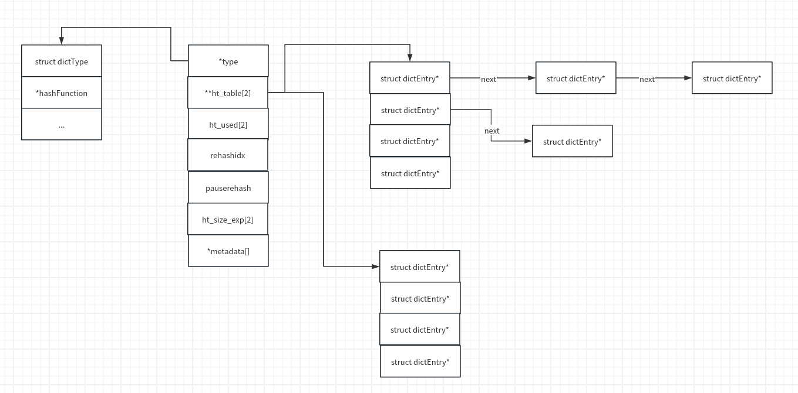

# 字典

字典也被称为散列表、哈希表，是用来存储键值对的一种数据结构。redis 是 K-V 型数据库，整个数据库使用字典来存储。

分析哈希表，通常需要考虑以下几个问题：

1. 使用什么哈希算法
2. 如何解决哈希冲突
3. 哈希表如何扩容

## 定义

哈希表的定义为 `struct dict `

```C
//src/dict.h
#define DICTHT_SIZE(exp) ((exp) == -1 ? 0 : (unsigned long)1<<(exp))
#define DICTHT_SIZE_MASK(exp) ((exp) == -1 ? 0 : (DICTHT_SIZE(exp))-1)

struct dict {
    dictType *type; //与该哈希表对应的特定操作类型

    dictEntry **ht_table[2]; //二维 dictEntry 数组，此处用两个元素是为了 rehash
    unsigned long ht_used[2];//两张哈希表中分别存储了多少数据

    long rehashidx; /* rehashing not in progress if rehashidx == -1 *///是否正在进行 rehash

    /* Keep small vars at end for optimal (minimal) struct padding */
    int16_t pauserehash; /* If >0 rehashing is paused (<0 indicates coding error) *///rehash 是否暂停
    signed char ht_size_exp[2]; /* exponent of size. (size = 1<<exp) *///哈希表的大小（固定为2的倍数）

    void *metadata[];           /* An arbitrary number of bytes (starting at a
                                 * pointer-aligned address) of size as defined
                                 * by dictType's dictEntryBytes. */
};

//通过设置下列指针，哈希表能够存储任何类型的数据
typedef struct dictType {
    uint64_t (*hashFunction)(const void *key);//哈希函数
    void *(*keyDup)(dict *d, const void *key);//复制 key
    void *(*valDup)(dict *d, const void *obj);//复制 value
    int (*keyCompare)(dict *d, const void *key1, const void *key2);//比较key
    void (*keyDestructor)(dict *d, void *key);//删除 key
    void (*valDestructor)(dict *d, void *obj);//删除 value
    int (*expandAllowed)(size_t moreMem, double usedRatio);
    /* Flags */
    /* The 'no_value' flag, if set, indicates that values are not used, i.e. the
     * dict is a set. When this flag is set, it's not possible to access the
     * value of a dictEntry and it's also impossible to use dictSetKey(). Entry
     * metadata can also not be used. */
    unsigned int no_value:1;
    /* If no_value = 1 and all keys are odd (LSB=1), setting keys_are_odd = 1
     * enables one more optimization: to store a key without an allocated
     * dictEntry. */
    unsigned int keys_are_odd:1;
    /* TODO: Add a 'keys_are_even' flag and use a similar optimization if that
     * flag is set. */

    /* Allow each dict and dictEntry to carry extra caller-defined metadata. The
     * extra memory is initialized to 0 when allocated. */
    size_t (*dictEntryMetadataBytes)(dict *d);
    size_t (*dictMetadataBytes)(void);
    /* Optional callback called after an entry has been reallocated (due to
     * active defrag). Only called if the entry has metadata. */
    void (*afterReplaceEntry)(dict *d, dictEntry *entry);
} dictType;
```

键值对的定义为

```C
//src/dict.c
struct dictEntry {
    void *key;//键
    union {
        void *val;
        uint64_t u64;
        int64_t s64;
        double d;
    } v;//联合，用于存储多种类型的值
    struct dictEntry *next;     /* Next entry in the same hash bucket. *///链表法处理哈希冲突
    void *metadata[];           /* An arbitrary number of bytes (starting at a
                                 * pointer-aligned address) of size as returned
                                 * by dictType's dictEntryMetadataBytes(). */
};
```

同一个哈希表中，键、值可以是不同的类型，但键必须是相同的类型，值也必须是相同的类型。

哈希表的结构如下



## 插入元素

redis 通过 `dictAdd` 向哈希表中插入元素

```c
//src/dict.c
int dictAdd(dict *d, void *key, void *val)
{
    dictEntry *entry = dictAddRaw(d,key,NULL);//调用 dictAddRaw

    if (!entry) return DICT_ERR;
    if (!d->type->no_value) dictSetVal(d, entry, val);//利用 dictAddRaw 返回的 entry 存储 value
    return DICT_OK;
}
```

`dictAddRaw` 的具体实现如下

```C
//src/dict.c
/*
	d：哈希表
	key：key
	existing：如果 key 已经存在且 existing 不为 NULL，则通过该参数带出对应的 dictEntry
	出错或者 key 已经存在则返回 NULL，否则返回插入的 dictEntry
*/
dictEntry *dictAddRaw(dict *d, void *key, dictEntry **existing)
{
    /* Get the position for the new key or NULL if the key already exists. */
    void *position = dictFindPositionForInsert(d, key, existing);//第一步：找到插入位置
    if (!position) return NULL;

    /* Dup the key if necessary. */
    if (d->type->keyDup) key = d->type->keyDup(d, key);

    return dictInsertAtPosition(d, key, position);//第二步：插入 dictEntry
}

/*
	找到合适的 bucket
*/
void *dictFindPositionForInsert(dict *d, const void *key, dictEntry **existing) {
    unsigned long idx, table;
    dictEntry *he;
    uint64_t hash = dictHashKey(d, key);//计算哈希值
    if (existing) *existing = NULL;
    if (dictIsRehashing(d)) _dictRehashStep(d);//判断是否在 rehash 的过程中

    /* Expand the hash table if needed */
    if (_dictExpandIfNeeded(d) == DICT_ERR)//判断是否需要进行扩容
        return NULL;
    for (table = 0; table <= 1; table++) {//在 ht_table[0]、ht_table[1] 中分别搜索
        idx = hash & DICTHT_SIZE_MASK(d->ht_size_exp[table]);//取余，计算索引
        /* Search if this slot does not already contain the given key */
        he = d->ht_table[table][idx];
        while(he) {//遍历 ht_table[table][idx] 所对应的链表，查找 key 是否存在
            void *he_key = dictGetKey(he);
            if (key == he_key || dictCompareKeys(d, key, he_key)) {
                if (existing) *existing = he;//key 已存在则通过 existing 带回
                return NULL;
            }
            he = dictGetNext(he);
        }
        if (!dictIsRehashing(d)) break;//如果当前哈希表不在 rehash 的过程中，那么 key 不可能存在于 ht_table[1]
    }

    /* If we are in the process of rehashing the hash table, the bucket is
     * always returned in the context of the second (new) hash table. */
    dictEntry **bucket = &d->ht_table[dictIsRehashing(d) ? 1 : 0][idx];
    return bucket;
}

/*
	在找到的 bucket 上进行插入操作
*/
dictEntry *dictInsertAtPosition(dict *d, void *key, void *position) {
    dictEntry **bucket = position; /* It's a bucket, but the API hides that. */
    dictEntry *entry;
    /* If rehashing is ongoing, we insert in table 1, otherwise in table 0.
     * Assert that the provided bucket is the right table. */
    int htidx = dictIsRehashing(d) ? 1 : 0;//根据是否处于扩容进程中判断插入到哪张表中
    assert(bucket >= &d->ht_table[htidx][0] &&
           bucket <= &d->ht_table[htidx][DICTHT_SIZE_MASK(d->ht_size_exp[htidx])]);
    size_t metasize = dictEntryMetadataSize(d);
    if (d->type->no_value) {
        assert(!metasize); /* Entry metadata + no value not supported. */
        if (d->type->keys_are_odd && !*bucket) {
            /* We can store the key directly in the destination bucket without the
             * allocated entry.
             *
             * TODO: Add a flag 'keys_are_even' and if set, we can use this
             * optimization for these dicts too. We can set the LSB bit when
             * stored as a dict entry and clear it again when we need the key
             * back. */
            entry = key;
            assert(entryIsKey(entry));
        } else {
            /* Allocate an entry without value. */
            entry = createEntryNoValue(key, *bucket);
        }
    } else {
        /* Allocate the memory and store the new entry.
         * Insert the element in top, with the assumption that in a database
         * system it is more likely that recently added entries are accessed
         * more frequently. */
        entry = zmalloc(sizeof(*entry) + metasize);
        assert(entryIsNormal(entry)); /* Check alignment of allocation */
        if (metasize > 0) {
            memset(dictEntryMetadata(entry), 0, metasize);
        }
        entry->key = key;
        entry->next = *bucket;
    }
    *bucket = entry;//使用头插法将 entry 插入链表中
    d->ht_used[htidx]++;

    return entry;
}
```

## 容量调整

redis 中的哈希表采取了渐进式的扩容方式，即每次操作数据时都进行一此单步扩容操作，这样可以避免长时间扩容导致的流程阻塞。

```C
//src/dict.c
/*
	扩容判断
*/
static int _dictExpandIfNeeded(dict *d)
{
    /* Incremental rehashing already in progress. Return. */
    if (dictIsRehashing(d)) return DICT_OK;

    /* If the hash table is empty expand it to the initial size. */
    if (DICTHT_SIZE(d->ht_size_exp[0]) == 0) return dictExpand(d, DICT_HT_INITIAL_SIZE);//此分支说明哈希表第一次初始化

    /* If we reached the 1:1 ratio, and we are allowed to resize the hash
     * table (global setting) or we should avoid it but the ratio between
     * elements/buckets is over the "safe" threshold, we resize doubling
     * the number of buckets. */
    if (!dictTypeExpandAllowed(d))
        return DICT_OK;
    if ((dict_can_resize == DICT_RESIZE_ENABLE &&//两个扩容条件满足其一即进行扩容操作：1.开启 DICT_RESIZE_ENABLE 并且负载因子等于1 2.未开启 DICT_RESIZE_FORBID 并且负载因子大于 dict_force_resize_ratio
         d->ht_used[0] >= DICTHT_SIZE(d->ht_size_exp[0])) ||
        (dict_can_resize != DICT_RESIZE_FORBID &&
         d->ht_used[0] / DICTHT_SIZE(d->ht_size_exp[0]) > dict_force_resize_ratio))
    {
        return dictExpand(d, d->ht_used[0] + 1);//进行扩容操作
    }
    return DICT_OK;
}

int dictTryExpand(dict *d, unsigned long size) {
    int malloc_failed;
    _dictExpand(d, size, &malloc_failed);
    return malloc_failed? DICT_ERR : DICT_OK;
}

/*
	扩容
*/
int _dictExpand(dict *d, unsigned long size, int* malloc_failed)
{
    if (malloc_failed) *malloc_failed = 0;

    /* the size is invalid if it is smaller than the number of
     * elements already inside the hash table */
    if (dictIsRehashing(d) || d->ht_used[0] > size)
        return DICT_ERR;

    /* the new hash table */
    dictEntry **new_ht_table;
    unsigned long new_ht_used;
    signed char new_ht_size_exp = _dictNextExp(size);//获取下一个比 size 大的2的幂的指数

    /* Detect overflows */
    size_t newsize = 1ul<<new_ht_size_exp;
    if (newsize < size || newsize * sizeof(dictEntry*) < newsize)
        return DICT_ERR;

    /* Rehashing to the same table size is not useful. */
    if (new_ht_size_exp == d->ht_size_exp[0]) return DICT_ERR;

    /* Allocate the new hash table and initialize all pointers to NULL */
    if (malloc_failed) {//尝试进行内存分配
        new_ht_table = ztrycalloc(newsize*sizeof(dictEntry*));
        *malloc_failed = new_ht_table == NULL;
        if (*malloc_failed)
            return DICT_ERR;
    } else
        new_ht_table = zcalloc(newsize*sizeof(dictEntry*));

    new_ht_used = 0;

    /* Is this the first initialization? If so it's not really a rehashing
     * we just set the first hash table so that it can accept keys. */
    if (d->ht_table[0] == NULL) {//进入此分支说明这是哈希表的初始化过程
        d->ht_size_exp[0] = new_ht_size_exp;
        d->ht_used[0] = new_ht_used;
        d->ht_table[0] = new_ht_table;
        return DICT_OK;
    }

    /* Prepare a second hash table for incremental rehashing */
    d->ht_size_exp[1] = new_ht_size_exp;//初始化 d->ht_table[1] 以进行扩容
    d->ht_used[1] = new_ht_used;
    d->ht_table[1] = new_ht_table;
    d->rehashidx = 0;
    return DICT_OK;
}

/*
	单步 rehash
*/
static void _dictRehashStep(dict *d) {
    if (d->pauserehash == 0) dictRehash(d,1);
}

/*
	n 步 rehash
	参数 n 表明本次最多 rehash n 个 bucket，在此过程中空 bucket 的数量必须小于 n*10 
*/
int dictRehash(dict *d, int n) {
    int empty_visits = n*10; /* Max number of empty buckets to visit. */
    unsigned long s0 = DICTHT_SIZE(d->ht_size_exp[0]);
    unsigned long s1 = DICTHT_SIZE(d->ht_size_exp[1]);
    if (dict_can_resize == DICT_RESIZE_FORBID || !dictIsRehashing(d)) return 0;//进行一些列是否需要 rehash 的判断
    if (dict_can_resize == DICT_RESIZE_AVOID && 
        ((s1 > s0 && s1 / s0 < dict_force_resize_ratio) ||
         (s1 < s0 && s0 / s1 < dict_force_resize_ratio)))
    {
        return 0;
    }

    while(n-- && d->ht_used[0] != 0) {
        dictEntry *de, *nextde;

        /* Note that rehashidx can't overflow as we are sure there are more
         * elements because ht[0].used != 0 */
        assert(DICTHT_SIZE(d->ht_size_exp[0]) > (unsigned long)d->rehashidx);
        while(d->ht_table[0][d->rehashidx] == NULL) {
            d->rehashidx++;
            if (--empty_visits == 0) return 1;
        }
        de = d->ht_table[0][d->rehashidx];//在 _dictExpand 中 d->rehashidx 初始化为0
        /* Move all the keys in this bucket from the old to the new hash HT */
        while(de) {//将 ht_table[0][d->rehashidx] 中所有的 key 移动到 ht_table[0] 中
            uint64_t h;

            nextde = dictGetNext(de);
            void *key = dictGetKey(de);
            /* Get the index in the new hash table */
            if (d->ht_size_exp[1] > d->ht_size_exp[0]) {//根据扩容还是缩容决定是否需要重新计算哈希值
                h = dictHashKey(d, key) & DICTHT_SIZE_MASK(d->ht_size_exp[1]);
            } else {
                /* We're shrinking the table. The tables sizes are powers of
                 * two, so we simply mask the bucket index in the larger table
                 * to get the bucket index in the smaller table. */
                h = d->rehashidx & DICTHT_SIZE_MASK(d->ht_size_exp[1]);
            }
            if (d->type->no_value) {
                if (d->type->keys_are_odd && !d->ht_table[1][h]) {
                    /* Destination bucket is empty and we can store the key
                     * directly without an allocated entry. Free the old entry
                     * if it's an allocated entry.
                     *
                     * TODO: Add a flag 'keys_are_even' and if set, we can use
                     * this optimization for these dicts too. We can set the LSB
                     * bit when stored as a dict entry and clear it again when
                     * we need the key back. */
                    assert(entryIsKey(key));
                    if (!entryIsKey(de)) zfree(decodeMaskedPtr(de));
                    de = key;
                } else if (entryIsKey(de)) {
                    /* We don't have an allocated entry but we need one. */
                    de = createEntryNoValue(key, d->ht_table[1][h]);
                } else {
                    /* Just move the existing entry to the destination table and
                     * update the 'next' field. */
                    assert(entryIsNoValue(de));
                    dictSetNext(de, d->ht_table[1][h]);
                }
            } else {
                dictSetNext(de, d->ht_table[1][h]);
            }
            d->ht_table[1][h] = de;
            d->ht_used[0]--;
            d->ht_used[1]++;
            de = nextde;
        }
        d->ht_table[0][d->rehashidx] = NULL;
        d->rehashidx++;//继续下一个 bucket
    }

    /* Check if we already rehashed the whole table... */
    if (d->ht_used[0] == 0) {//如果 rehash 已经完成，则将 ht_table[0] 指向 ht_table[1]
        zfree(d->ht_table[0]);
        /* Copy the new ht onto the old one */
        d->ht_table[0] = d->ht_table[1];
        d->ht_used[0] = d->ht_used[1];
        d->ht_size_exp[0] = d->ht_size_exp[1];
        _dictReset(d, 1);//重置 d->ht_table[1]
        d->rehashidx = -1;
        return 0;
    }

    /* More to rehash... */
    return 1;
}
```

## 哈希算法

redis 中默认采用的是 `siphash` 算法，可以有效抵抗[哈希洪水攻击](https://blog.csdn.net/qq_35656655/article/details/118889489)，关于 `siphash` 的介绍可以参考 https://www.jiamisoft.com/blog/33725-siphash.html
