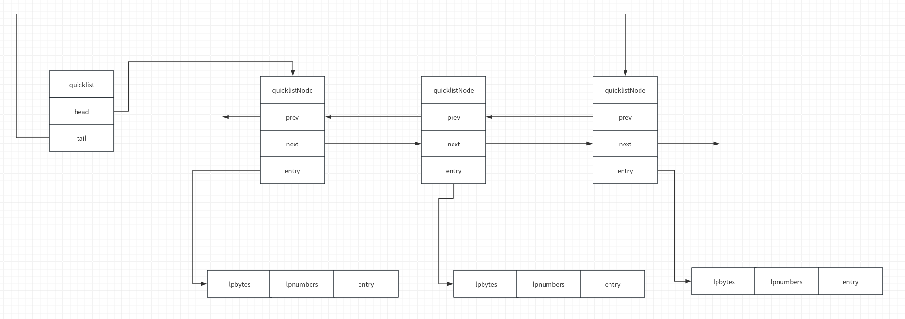

# 快速列表

压缩列表虽然可以节省内存空间，但是在插入和删除元素的时候需要进行大量的内存拷贝操作。为了解决这个问题，redis 引入了快速列表，以实现时间效率和空间效率较好的折中。快速列表是一个双向链表，链表中的每个节点是一个压缩列表（在当前版本7.2.3中，压缩列表已经由 listpack 代替）。

## 定义

快速列表的定义如下

```C
//src/quicklist.h
typedef struct quicklist {
    quicklistNode *head; //双向链表的头节点
    quicklistNode *tail; //双向链表的尾节点
    unsigned long count;        /* total count of all entries in all listpacks *///所有节点中的总的元素数量
    unsigned long len;          /* number of quicklistNodes *///链表中的节点数量
    signed int fill : QL_FILL_BITS;       /* fill factor for individual nodes *///file 取正值，表示每个节点最多有 fill 个元素，取负值表示每个节点最多占用 2^(1-fill)KB 的内存（例如，-5表示每个节点最多能占用64KB内存），对应的配置为 server.list_max_listpack_size
    unsigned int compress : QL_COMP_BITS; /* depth of end nodes not to compress;0=off *///0表示禁用压缩，否则表示快表两端各有 compress 个节点不压缩，对应的配置为 server.list_compress_depth
    unsigned int bookmark_count: QL_BM_BITS;//快照节点的数量
    quicklistBookmark bookmarks[];//快照节点数组
} quicklist;

typedef struct quicklistNode {
    struct quicklistNode *prev;//用于构成双向链表
    struct quicklistNode *next;//用于构成双向链表
    unsigned char *entry;//指向该节点对应的 listpack
    size_t sz;             /* entry size in bytes *///listpack 占用的字节数
    unsigned int count : 16;     /* count of items in listpack *///listpack 中的元素数量
    unsigned int encoding : 2;   /* RAW==1 or LZF==2 *///是否压缩：2已经压缩，1未压缩
    unsigned int container : 2;  /* PLAIN==1 or PACKED==2 *///entry 指向的容器类型，1表示 plain node，2表示 listpack；当待插入的元素大于 packed_threshold 时，redis 会直接存储该元素而不是放到 listpack 中，此时该节点的 container 为1
    unsigned int recompress : 1; /* was this node previous compressed? *///表示暂时解压，后续需要时再将其压缩
    unsigned int attempted_compress : 1; /* node can't compress; too small */
    unsigned int dont_compress : 1; /* prevent compression of entry that will be used later */
    unsigned int extra : 9; /* more bits to steal for future usage */
} quicklistNode;
```

快表的存储结构如下



## 在头部插入元素

redis 通过 `quicklistPushTail` 向快表头部插入元素

```C
//src/quicklist.c
/*
	如果新建头节点则返回1,否则返回0
	1.判断插入的元素是否为超大元素，是则插入平凡节点
	2.判断当前头节点是否可以继续插入元素，是则直接在当前头节点插入
	3.当前头节点无法插入元素则新建节点，并根据 compress 配置压缩节点
*/
int quicklistPushHead(quicklist *quicklist, void *value, size_t sz) {
    quicklistNode *orig_head = quicklist->head;

    if (unlikely(isLargeElement(sz))) {//这里判断待插入元素的大小是否超过 packed_threshold
        __quicklistInsertPlainNode(quicklist, quicklist->head, value, sz, 0);//条件为真则新建一个平凡节点并插入
        return 1;
    }

    if (likely(
            _quicklistNodeAllowInsert(quicklist->head, quicklist->fill, sz))) {//判断当前头节点是否允许继续插入
        quicklist->head->entry = lpPrepend(quicklist->head->entry, value, sz);//如果允许继续插入，则向 listpack 头部插入一个元素
        quicklistNodeUpdateSz(quicklist->head);//更新当前节点的 sz 属性
    } else {//否则新建节点
        quicklistNode *node = quicklistCreateNode();
        node->entry = lpPrepend(lpNew(0), value, sz);

        quicklistNodeUpdateSz(node);//更新当前节点的 sz 属性
        _quicklistInsertNodeBefore(quicklist, quicklist->head, node);
    }
    quicklist->count++;//更新快表元素总数量
    quicklist->head->count++;//更新头节点元素总数量
    return (orig_head != quicklist->head);
}

#define isLargeElement(size) ((size) >= packed_threshold)
/*
插入平凡节点
*/
static void __quicklistInsertPlainNode(quicklist *quicklist, quicklistNode *old_node,
                                       void *value, size_t sz, int after) {
    __quicklistInsertNode(quicklist, old_node, __quicklistCreatePlainNode(value, sz), after);
    quicklist->count++;
}

/*
	将 new_node 插入到 old_node 之后（after为1）或之前（after为0）
*/
REDIS_STATIC void __quicklistInsertNode(quicklist *quicklist,
                                        quicklistNode *old_node,
                                        quicklistNode *new_node, int after) {
    if (after) {//根据 after 进行插入工作（插入到 old_node 之前还是之后）
        new_node->prev = old_node;
        if (old_node) {
            new_node->next = old_node->next;
            if (old_node->next)
                old_node->next->prev = new_node;
            old_node->next = new_node;
        }
        if (quicklist->tail == old_node)
            quicklist->tail = new_node;
    } else {
        new_node->next = old_node;
        if (old_node) {
            new_node->prev = old_node->prev;
            if (old_node->prev)
                old_node->prev->next = new_node;
            old_node->prev = new_node;
        }
        if (quicklist->head == old_node)
            quicklist->head = new_node;
    }
    /* If this insert creates the only element so far, initialize head/tail. */
    if (quicklist->len == 0) {
        quicklist->head = quicklist->tail = new_node;
    }

    /* Update len first, so in __quicklistCompress we know exactly len */
    quicklist->len++;

    if (old_node)//分别对新旧节点进行压缩处理
        quicklistCompress(quicklist, old_node);

    quicklistCompress(quicklist, new_node);
}

/*
	用于判断快表中的节点 node 是否可以继续插入元素
*/
REDIS_STATIC int _quicklistNodeAllowInsert(const quicklistNode *node,
                                           const int fill, const size_t sz) {
    if (unlikely(!node))
        return 0;

    if (unlikely(QL_NODE_IS_PLAIN(node) || isLargeElement(sz)))//node 是平凡节点或者元素属于超大元素则无法插入
        return 0;

    /* Estimate how many bytes will be added to the listpack by this one entry.
     * We prefer an overestimation, which would at worse lead to a few bytes
     * below the lowest limit of 4k (see optimization_level).
     * Note: No need to check for overflow below since both `node->sz` and
     * `sz` are to be less than 1GB after the plain/large element check above. */
    size_t new_sz = node->sz + sz + SIZE_ESTIMATE_OVERHEAD;//这里对插入之后的 listpack 进行了尽可能大的估计，即评估其大小上限
    if (unlikely(quicklistNodeExceedsLimit(fill, new_sz, node->count + 1)))//根据当前 listpack 的大小以及元素数量评估是否可以继续插入
        return 0;
    return 1;
}

/*
	检查节点限制，未超过限制返回0,否则返回1
*/
int quicklistNodeExceedsLimit(int fill, size_t new_sz, unsigned int new_count) {
    size_t sz_limit;
    unsigned int count_limit;
    quicklistNodeLimit(fill, &sz_limit, &count_limit);//根据 fill 计算 listpack 节点的大小限制 sz_limit 或者元素数量限制 count_limit

    if (likely(sz_limit != SIZE_MAX)) {//根据实际情况，分别判断大小或者数量是否超阈值
        return new_sz > sz_limit;
    } else if (count_limit != UINT_MAX) {
        /* when we reach here we know that the limit is a size limit (which is
         * safe, see comments next to optimization_level and SIZE_SAFETY_LIMIT) */
        if (!sizeMeetsSafetyLimit(new_sz)) return 1;//按照数量判断能否插入时依然要对 listpack 的大小进行限制，默认不能超过 SIZE_SAFETY_LIMIT
        return new_count > count_limit;
    }

    redis_unreachable();
}

/*
	根据 fill 计算 listpack 节点的大小限制 size 或者元素数量限制 count
*/
void quicklistNodeLimit(int fill, size_t *size, unsigned int *count) {
    *size = SIZE_MAX;
    *count = UINT_MAX;

    if (fill >= 0) {//fill 大于0则计算 count，否则计算 size
        /* Ensure that one node have at least one entry */
        *count = (fill == 0) ? 1 : fill;
    } else {
        size_t offset = (-fill) - 1;//optimization_level 中存放了 fill 取不同值时 listpack 的最大大小
        size_t max_level = sizeof(optimization_level) / sizeof(*optimization_level);
        if (offset >= max_level) offset = max_level - 1;
        *size = optimization_level[offset];
    }
}

/*
	用于对节点进行压缩的宏定义，如果 node 是一个压缩过的节点，则直接压缩即可，否则需要根据快表的 compress 设置进行调整
*/
#define quicklistCompress(_ql, _node)                                          \
    do {                                                                       \
        if ((_node)->recompress)                                               \
            quicklistCompressNode((_node));                                    \
        else                                                                   \
            __quicklistCompress((_ql), (_node));                               \
    } while (0)

/*
	宏定义，判断节点是否未压缩并调用 __quicklistCompressNode 对 node 进行压缩
*/
#define quicklistCompressNode(_node)                                           \
    do {                                                                       \
        if ((_node) && (_node)->encoding == QUICKLIST_NODE_ENCODING_RAW) {     \
            __quicklistCompressNode((_node));                                  \
        }                                                                      \
    } while (0)

/*
	对快表的节点进行解压缩，使其满足 compress 属性
*/
REDIS_STATIC void __quicklistCompress(const quicklist *quicklist,
                                      quicklistNode *node) {
    if (quicklist->len == 0) return;

    /* The head and tail should never be compressed (we should not attempt to recompress them) */
    assert(quicklist->head->recompress == 0 && quicklist->tail->recompress == 0);

    /* If length is less than our compress depth (from both sides),
     * we can't compress anything. */
    if (!quicklistAllowsCompression(quicklist) ||
        quicklist->len < (unsigned int)(quicklist->compress * 2))
        return;

#if 0
    /* Optimized cases for small depth counts */
	/*...*/
#endif

    /* Iterate until we reach compress depth for both sides of the list.a
     * Note: because we do length checks at the *top* of this function,
     *       we can skip explicit null checks below. Everything exists. */
    quicklistNode *forward = quicklist->head;//从链表的两边向中间进行解压缩操作
    quicklistNode *reverse = quicklist->tail;
    int depth = 0;
    int in_depth = 0;
    while (depth++ < quicklist->compress) {//每端的未压缩节点的数量小于 compress
        quicklistDecompressNode(forward);//解压缩
        quicklistDecompressNode(reverse);

        if (forward == node || reverse == node)
            in_depth = 1;//进行标记，说明 node 在需要解压缩的范围之内

        /* We passed into compress depth of opposite side of the quicklist
         * so there's no need to compress anything and we can exit. */
        if (forward == reverse || forward->next == reverse)//对向执行过程中相遇，说明该快表中没有节点需要压缩
            return;

        forward = forward->next;
        reverse = reverse->prev;
    }

    if (!in_depth)//node 不在需要解压缩的范围之内，则对其进行压缩
        
        quicklistCompressNode(node);

    /* At this point, forward and reverse are one node beyond depth */
    quicklistCompressNode(forward);//假如 compress 为2，上面的 while 循环结束时 forward 和 reverse 已经指向从外向内数的第三个元素了
    quicklistCompressNode(reverse);
}
```

## 在指定位置插入元素

`_quicklistInsert` 可以在指定位置插入元素

```C
//src/quicklist.c
/*
	在指定节点插入元素
*/
REDIS_STATIC void _quicklistInsert(quicklistIter *iter, quicklistEntry *entry,
                                   void *value, const size_t sz, int after)
{
    quicklist *quicklist = iter->quicklist;
    int full = 0, at_tail = 0, at_head = 0, avail_next = 0, avail_prev = 0;
    int fill = quicklist->fill;
    quicklistNode *node = entry->node;
    quicklistNode *new_node = NULL;

    if (!node) {//创建新节点
        /* we have no reference node, so let's create only node in the list */
        D("No node given!");
        if (unlikely(isLargeElement(sz))) {
            __quicklistInsertPlainNode(quicklist, quicklist->tail, value, sz, after);
            return;
        }
        new_node = quicklistCreateNode();
        new_node->entry = lpPrepend(lpNew(0), value, sz);
        __quicklistInsertNode(quicklist, NULL, new_node, after);
        new_node->count++;
        quicklist->count++;
        return;
    }

    /* Populate accounting flags for easier boolean checks later */
    if (!_quicklistNodeAllowInsert(node, fill, sz)) {//检查当前节点能否继续插入
        D("Current node is full with count %d with requested fill %d",
          node->count, fill);
        full = 1;
    }

    if (after && (entry->offset == node->count - 1 || entry->offset == -1)) {//检查是否 listpack 尾插以及后继节点是否已满
        D("At Tail of current listpack");
        at_tail = 1;
        if (_quicklistNodeAllowInsert(node->next, fill, sz)) {
            D("Next node is available.");
            avail_next = 1;
        }
    }

    if (!after && (entry->offset == 0 || entry->offset == -(node->count))) {//检查是否 listpack 头插以及前驱节点是否已满
        D("At Head");
        at_head = 1;
        if (_quicklistNodeAllowInsert(node->prev, fill, sz)) {
            D("Prev node is available.");
            avail_prev = 1;
        }
    }

    if (unlikely(isLargeElement(sz))) {//如果插入的是超大节点
        if (QL_NODE_IS_PLAIN(node) || (at_tail && after) || (at_head && !after)) {//头插或尾插直接新建一个节点插入
            __quicklistInsertPlainNode(quicklist, node, value, sz, after);
        } else {//否则要在 entry->offset 的位置将 node 分裂，并在分裂后的节点中间插入
            quicklistDecompressNodeForUse(node);
            new_node = _quicklistSplitNode(node, entry->offset, after);
            quicklistNode *entry_node = __quicklistCreatePlainNode(value, sz);
            __quicklistInsertNode(quicklist, node, entry_node, after);
            __quicklistInsertNode(quicklist, entry_node, new_node, after);
            quicklist->count++;
        }
        return;
    }

    /* Now determine where and how to insert the new element *///根据上面设置的标志位开始执行插入动作
    if (!full && after) {
        D("Not full, inserting after current position.");
        quicklistDecompressNodeForUse(node);
        node->entry = lpInsertString(node->entry, value, sz, entry->zi, LP_AFTER, NULL);
        node->count++;
        quicklistNodeUpdateSz(node);
        quicklistRecompressOnly(node);
    } else if (!full && !after) {
        D("Not full, inserting before current position.");
        quicklistDecompressNodeForUse(node);
        node->entry = lpInsertString(node->entry, value, sz, entry->zi, LP_BEFORE, NULL);
        node->count++;
        quicklistNodeUpdateSz(node);
        quicklistRecompressOnly(node);
    } else if (full && at_tail && avail_next && after) {
        /* If we are: at tail, next has free space, and inserting after:
         *   - insert entry at head of next node. */
        D("Full and tail, but next isn't full; inserting next node head");
        new_node = node->next;
        quicklistDecompressNodeForUse(new_node);
        new_node->entry = lpPrepend(new_node->entry, value, sz);
        new_node->count++;
        quicklistNodeUpdateSz(new_node);
        quicklistRecompressOnly(new_node);
        quicklistRecompressOnly(node);
    } else if (full && at_head && avail_prev && !after) {
        /* If we are: at head, previous has free space, and inserting before:
         *   - insert entry at tail of previous node. */
        D("Full and head, but prev isn't full, inserting prev node tail");
        new_node = node->prev;
        quicklistDecompressNodeForUse(new_node);
        new_node->entry = lpAppend(new_node->entry, value, sz);
        new_node->count++;
        quicklistNodeUpdateSz(new_node);
        quicklistRecompressOnly(new_node);
        quicklistRecompressOnly(node);
    } else if (full && ((at_tail && !avail_next && after) ||
                        (at_head && !avail_prev && !after))) {
        /* If we are: full, and our prev/next has no available space, then:
         *   - create new node and attach to quicklist */
        D("\tprovisioning new node...");
        new_node = quicklistCreateNode();
        new_node->entry = lpPrepend(lpNew(0), value, sz);
        new_node->count++;
        quicklistNodeUpdateSz(new_node);
        __quicklistInsertNode(quicklist, node, new_node, after);
    } else if (full) {
        /* else, node is full we need to split it. */
        /* covers both after and !after cases */
        D("\tsplitting node...");
        quicklistDecompressNodeForUse(node);
        new_node = _quicklistSplitNode(node, entry->offset, after);
        if (after)
            new_node->entry = lpPrepend(new_node->entry, value, sz);
        else
            new_node->entry = lpAppend(new_node->entry, value, sz);
        new_node->count++;
        quicklistNodeUpdateSz(new_node);
        __quicklistInsertNode(quicklist, node, new_node, after);
        _quicklistMergeNodes(quicklist, node);//这种情况下当前 node 被分割为两个 node，需要检查能否与前后节点进行合并
    }

    quicklist->count++;

    /* In any case, we reset iterator to forbid use of iterator after insert.
     * Notice: iter->current has been compressed in _quicklistInsert(). */
    resetIterator(iter); 
}
```
