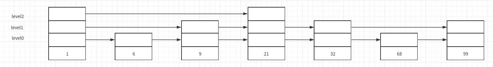
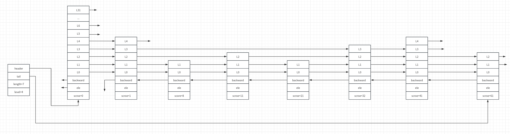

# 跳跃表

跳跃表是一种多层的有序链表，通过空间换时间的方式优化链表的查找性能。redis 中，跳跃表主要用于有序集合的底层实现。

## 结构

一个典型的跳跃表的结构如图所示：



假如查找元素68，查找路径如下：

1. 从 level2 开始查找，1的值比68小，查找1的后继节点
2. 21比68小，同时21没有后继节点，下降一层到 level1
3. level1 中，21的后继节点为32小于68，继续查找后继节点
4. 32的后继节点为99大于68，下降一层到 level0
5. 此时32的后继节点为68，找到目标元素

redis 中跳跃表相关的定义如下：

```C
//src/server.h
typedef struct zskiplistNode {
    sds ele; //节点值
    double score; //分数，用于排序
    struct zskiplistNode *backward; //前驱节点，只有第一层的节点有效
    struct zskiplistLevel {
        struct zskiplistNode *forward;//指向本层的下一个节点，最后一个节点为 null
        unsigned long span;//forward 指向的节点与本节点之间的元素个数
    } level[];//柔性数组，每个节点的长度不一样，生成跳跃表节点时随机指定
} zskiplistNode;

typedef struct zskiplist {
    struct zskiplistNode *header, *tail;//指向头尾节点
    unsigned long length;//跳跃表长度（不包含头节点）
    int level;//跳跃表高度
} zskiplist;
```

redis 中的跳跃表的实现如图所示（空的箭头表示 null）：



## 创建

### 确定层高

redis 中的跳跃表层高最低为1，最高为 `ZSKIPLIST_MAXLEVEL`。redis 通过 `zslRandomLevel` 为每一个节点生成一个随机层高。

```C
//src/server.h
#define ZSKIPLIST_MAXLEVEL 32 /* Should be enough for 2^64 elements */
#define ZSKIPLIST_P 0.25      /* Skiplist P = 1/4 */

//src/t_zset.c
/*
	返回 [1,32] 之间的随机数，越大的数返回的概率越小
*/
int zslRandomLevel(void) {
    static const int threshold = ZSKIPLIST_P*RAND_MAX;
    int level = 1;
    while (random() < threshold)//random 生成 [0,RAND_MAX] 之间的随机数
        level += 1;
    return (level<ZSKIPLIST_MAXLEVEL) ? level : ZSKIPLIST_MAXLEVEL;
}
```

### 创建节点

创建节点时，层高、分数、值等都已经确定，仅需申请内存。

```C
//src/t_zset.c
zskiplistNode *zslCreateNode(int level, double score, sds ele) {
    zskiplistNode *zn =
        zmalloc(sizeof(*zn)+level*sizeof(struct zskiplistLevel));
    zn->score = score;
    zn->ele = ele;
    return zn;
}
```

### 创建跳跃表

创建跳跃表的控制结构以及头节点。

```C
//src/t_zset.c
/*
	1.创建控制结构
	2.初始化高度为1,长度为0
	3.创建头节点并初始化头节点字段
*/
zskiplist *zslCreate(void) {
    int j;
    zskiplist *zsl;

    zsl = zmalloc(sizeof(*zsl));
    zsl->level = 1;
    zsl->length = 0;
    zsl->header = zslCreateNode(ZSKIPLIST_MAXLEVEL,0,NULL);
    for (j = 0; j < ZSKIPLIST_MAXLEVEL; j++) {
        zsl->header->level[j].forward = NULL;
        zsl->header->level[j].span = 0;
    }
    zsl->header->backward = NULL;
    zsl->tail = NULL;
    return zsl;
}
```

## 插入节点

redis 通过 `zslInsert` 插入节点。

```C
//src/t_zset.c
/*
	插入节点的过程：
		1.查找要插入的位置
		2.调整跳跃表高度
		3.插入节点
		4.调整 backward
	由调用者确保没有重复元素插入。对于分值相同的元素，按照字典顺序排列
*/
zskiplistNode *zslInsert(zskiplist *zsl, double score, sds ele) {
    zskiplistNode *update[ZSKIPLIST_MAXLEVEL], *x;//update 记录每层插入位置的前驱节点
    unsigned long rank[ZSKIPLIST_MAXLEVEL];//rank 记录当前层从 header 节点到 update[i] 节点所经历的步长
    int i, level;

    serverAssert(!isnan(score));
    x = zsl->header;
    for (i = zsl->level-1; i >= 0; i--) {//从最顶层开始，按照先向右（forward）、再向下（level 减小）的顺序查找节点插入位置
        /* store rank that is crossed to reach the insert position */
        rank[i] = i == (zsl->level-1) ? 0 : rank[i+1];
        while (x->level[i].forward && //根据 x->level[i] 的下一个元素 x->level[i].forward 判断 x 是否是插入位置的前驱节点
                (x->level[i].forward->score < score ||
                    (x->level[i].forward->score == score &&
                    sdscmp(x->level[i].forward->ele,ele) < 0)))
        {
            rank[i] += x->level[i].span;//累加 span
            x = x->level[i].forward;//x 向右移动
        }
        update[i] = x;//跳出循环说明 x 是前驱节点，记录 x
    }
    /* we assume the element is not already inside, since we allow duplicated
     * scores, reinserting the same element should never happen since the
     * caller of zslInsert() should test in the hash table if the element is
     * already inside or not. */
    level = zslRandomLevel();
    if (level > zsl->level) {//如果插入节点的高度超过跳跃表的当前高度，则需要更新 header 节点对应的 level
        for (i = zsl->level; i < level; i++) {
            rank[i] = 0;
            update[i] = zsl->header;
            update[i]->level[i].span = zsl->length;
        }
        zsl->level = level;//更新 level
    }
    x = zslCreateNode(level,score,ele);
    for (i = 0; i < level; i++) {//执行插入操作，调整指针关系
        x->level[i].forward = update[i]->level[i].forward;
        update[i]->level[i].forward = x;

        /* update span covered by update[i] as x is inserted here */
        x->level[i].span = update[i]->level[i].span - (rank[0] - rank[i]);//rank[0] - rank[i] 表示 update[0] 到 update[i] 之间的元素个数
        update[i]->level[i].span = (rank[0] - rank[i]) + 1;//x 在 update[0] 之后插入，所以要+1
    }

    /* increment span for untouched levels */
    for (i = level; i < zsl->level; i++) {//如果插入高度小于跳跃表高度，则需要更新从 level 到 zsl->level-1 层的 span
        update[i]->level[i].span++;
    }

    x->backward = (update[0] == zsl->header) ? NULL : update[0];//调整节点指针，维护双向链表
    if (x->level[0].forward)
        x->level[0].forward->backward = x;
    else
        zsl->tail = x;
    zsl->length++;
    return x;
}
```

## 删除节点

redis 通过 `zslDelete` 删除节点指定的节点。

```C
//src/t_zset.c
/*
	根据 score、ele 删除匹配的节点，node 带回被删除的节点
	1.查找需要根新的节点
	2.设置 sapn 和 forward
	3.成功个删除返回1,未找到响应节点返回0
*/
int zslDelete(zskiplist *zsl, double score, sds ele, zskiplistNode **node) {
    zskiplistNode *update[ZSKIPLIST_MAXLEVEL], *x;//update 记录删除节点的前驱节点
    int i;

    x = zsl->header;
    for (i = zsl->level-1; i >= 0; i--) {
        while (x->level[i].forward &&
                (x->level[i].forward->score < score ||
                    (x->level[i].forward->score == score &&
                     sdscmp(x->level[i].forward->ele,ele) < 0)))
        {
            x = x->level[i].forward;
        }
        update[i] = x;
    }
    /* We may have multiple elements with the same score, what we need
     * is to find the element with both the right score and object. */
    x = x->level[0].forward;//x 向右移动
    if (x && score == x->score && sdscmp(x->ele,ele) == 0) {//比较是否为待删除的节点
        zslDeleteNode(zsl, x, update);//删除
        if (!node)
            zslFreeNode(x);
        else
            *node = x;
        return 1;
    }
    return 0; /* not found */
}

/*
	删除节点，调整指针关系和 span
*/
void zslDeleteNode(zskiplist *zsl, zskiplistNode *x, zskiplistNode **update) {
    int i;
    for (i = 0; i < zsl->level; i++) {
        if (update[i]->level[i].forward == x) {
            update[i]->level[i].span += x->level[i].span - 1;
            update[i]->level[i].forward = x->level[i].forward;
        } else {
            update[i]->level[i].span -= 1;//比 x 高的部分只需要更新 span
        }
    }
    if (x->level[0].forward) {//调整 backward 指针
        x->level[0].forward->backward = x->backward;
    } else {//该分支说明 x 是最后一个节点，需要调整 zsl->tail
        zsl->tail = x->backward;
    }
    while(zsl->level > 1 && zsl->header->level[zsl->level-1].forward == NULL)//如果删除 x 导致跳跃表高度降低，需要调整 zsl->level
        zsl->level--;
    zsl->length--;
}
```

## 根据索引查找元素

redis 通过 `zslGetElementByRank` 根据索引查找节点（索引从1开始）。

```C
//src/t_zset.c
zskiplistNode* zslGetElementByRank(zskiplist *zsl, unsigned long rank) {
    zskiplistNode *x;
    unsigned long traversed = 0;//记录当前节点的索引值
    int i;

    x = zsl->header;
    for (i = zsl->level-1; i >= 0; i--) {
        while (x->level[i].forward && (traversed + x->level[i].span) <= rank)
        {
            traversed += x->level[i].span;
            x = x->level[i].forward;
        }
        if (traversed == rank) {//找到
            return x;
        }
    }
    return NULL;
}
```

## 删除跳跃表

删除跳跃表的逻辑比较简单，直接遍历删除即可。

```C
//src/t_zset.c
void zslFree(zskiplist *zsl) {
    zskiplistNode *node = zsl->header->level[0].forward, *next;

    zfree(zsl->header);//释放头节点
    while(node) {//遍历各个节点
        next = node->level[0].forward;
        zslFreeNode(node);//释放节点
        node = next;
    }
    zfree(zsl);//释放控制结构
}

/*
	释放节点
*/
void zslFreeNode(zskiplistNode *node) {
    sdsfree(node->ele);
    zfree(node);
}
```

